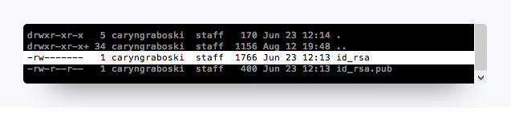
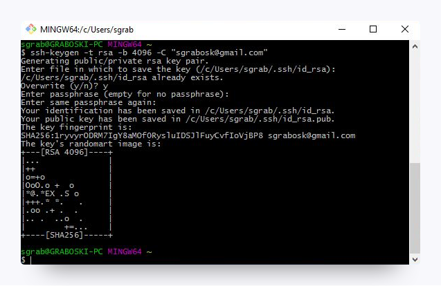
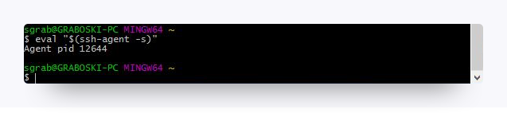
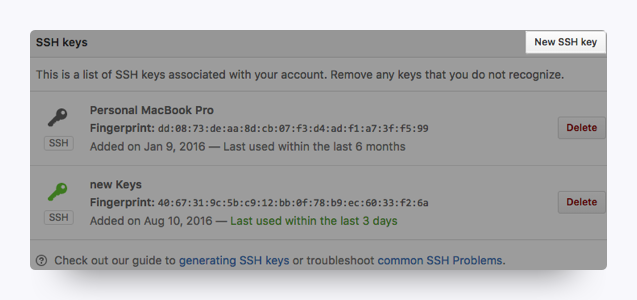
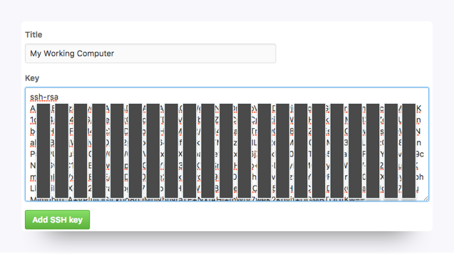
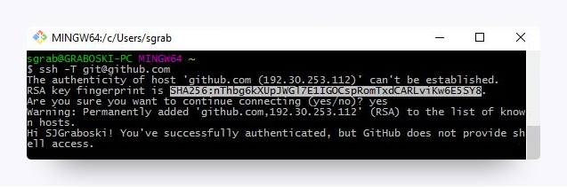
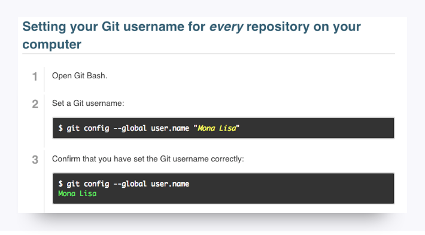
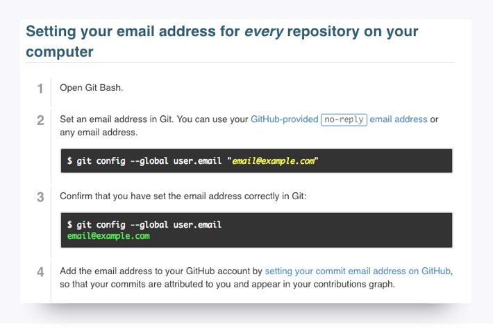

# SSH Key Windows

[Back to Home](../../../../README.md)

<hr>

Generating SSH keys allows developers to interface with certain remote services without having to constantly type out login information. You're going to set up an SSH key for GitHub.

Without a key, you won’t be able to push your code to GitHub without entering a password each time; trust us, that would be as irritating as needing a key to open every door in your home.

1. If you haven't signed up for a GitHub account yet, you'll need to do so before moving on with these steps. Visit [https://github.com](https://github.com).

2. Open up Bash.

3. We need to set up SSH keys. First, let’s make sure you don’t already have a set of keys on your computer. Type this into your Bash window **(copying and pasting will not work)**:

    ```
    ls –al ~/.ssh
    ```

    * If no keys pop up, move onto step 4.

    * If keys do pop up, check that none of them are listed under `id_rsa`, like in this image:
    
    

    * If you do find a key with a matching name, then you can either overwrite it by following steps 4 to 6, or you can use the same key in steps 10 and beyond. Be advised that you'll have to remember the password tied to your key if you decide not to overwrite it.

4. Type in this command along with your email to generate your keys

    ```
    ssh-keygen –t rsa –b 4096 –C "YOURGITHUBEMAIL@PLACEHOLDER.NET"
    ```

5. When asked to enter a file to save the key, just hit `enter`.

    * Also enter a passphrase for your key. 

    * Note: You shouldn’t see any characters appear in the window while typing the password.

6. When you’re finished, your window should look like this:

    

7. For the next step, we need to use a tool called ssh agent to link our key with our machine. Let’s test whether ssh-agent is working. Run this command in Bash:

    ```
    eval "$(ssh-agent –s)"
    ```

    * If your Bash window looks like the below image, move onto the next step.

    

8. Now run this command:

    ```
    ssh-add ~/.ssh/id_rsa
    ```

9. When prompted for a passphrase, enter the one associated with the key.

    * If you’ve forgotten this password, just create a new one, starting with step 4.

10. We need to add the key to GitHub. Copy the key to your clipboard by entering this command:

    ```
    clip < ~/.ssh/id_rsa.pub
    ```

    * You shouldn’t see any kind of message when you run this command. If you do, make sure you entered it correctly.

    * Do not copy anything else to your clipboard until you finish the next instructions. Otherwise, you’ll have to repeat this step again.

11. Go to [https://github.com/settings/ssh](https://github.com/settings/ssh). Click the “New SSH Key” button.

    

12. When the form pops up, enter a name for your computer in the Title input. In the Key text box, paste the SSH key you copied in step 10.
    

13. Now we just need to add GitHub to your computer’s list of acceptable SSH hosts. Go back to your Bash window. Type in this command:

    ```
    ssh –T git@github.com
    ```

    * You should see an RSA fingerprint in your window. Only enter “yes” if it matches the one highlighted in the image below.

    

<hr>

## Setting your Git username for every repository on your computer ##

Git uses a username to associate commits with an identity. The Git username is not the same as your GitHub username.

You can change the name that is associated with your Git commits using the `git config` command. The new name you set will be visible in any future commits you push to GitHub from the command line. If you'd like to keep your real name private, you can use any text as your Git username. Changing the name associated with your Git commits using `git config` will only affect future commits and will not change the name used for past commits.



<hr>

## Setting your email address for every repository on your computer ##

GitHub uses the email address set in your local Git configuration to associate commits pushed from the command line with your GitHub account.

You can use the `git config` command to change the email address you associate with your Git commits. The new email address you set will be visible in any future commits you push to GitHub from the command line. Any commits you made prior to changing your commit email address are still associated with your previous email address.

For more information on commit email addresses, including your GitHub-provided `noreply` email address, see "[About commit email addresses](https://help.github.com/articles/about-commit-email-addresses/)."

