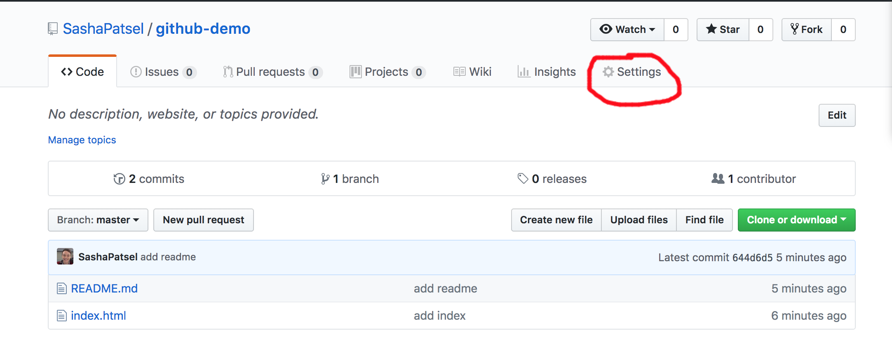
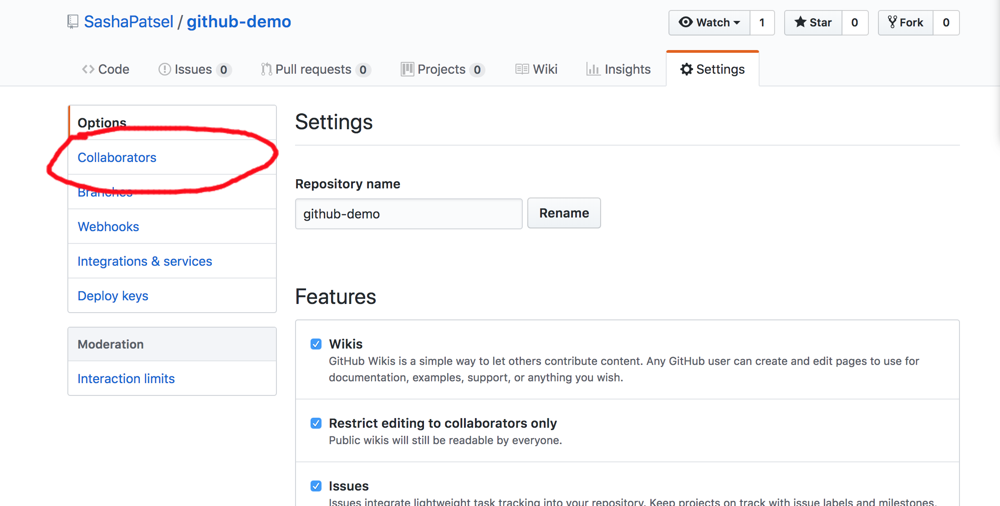
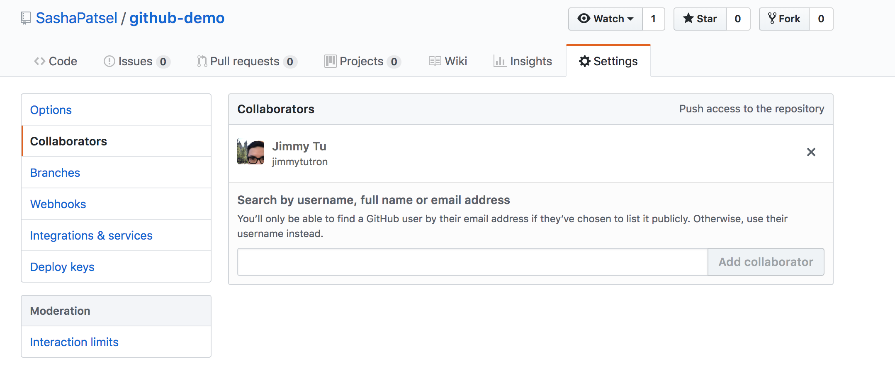
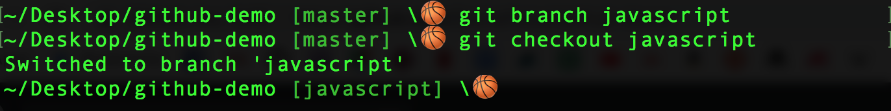
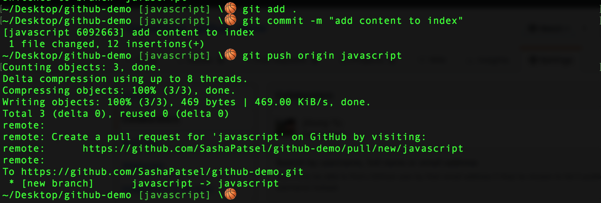
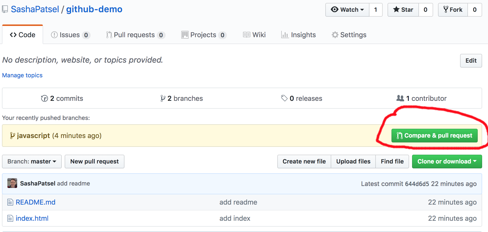
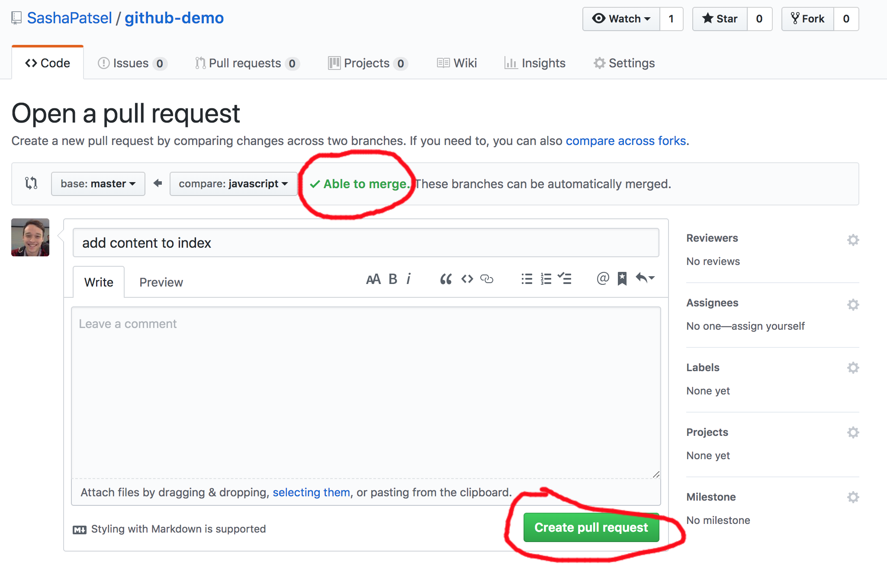
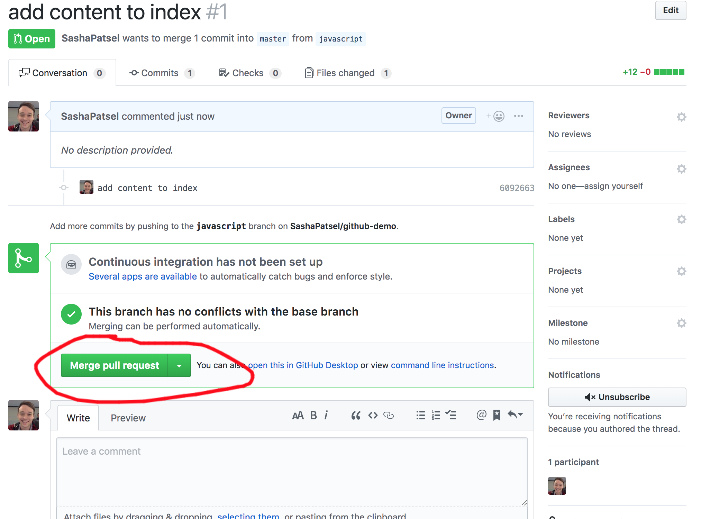
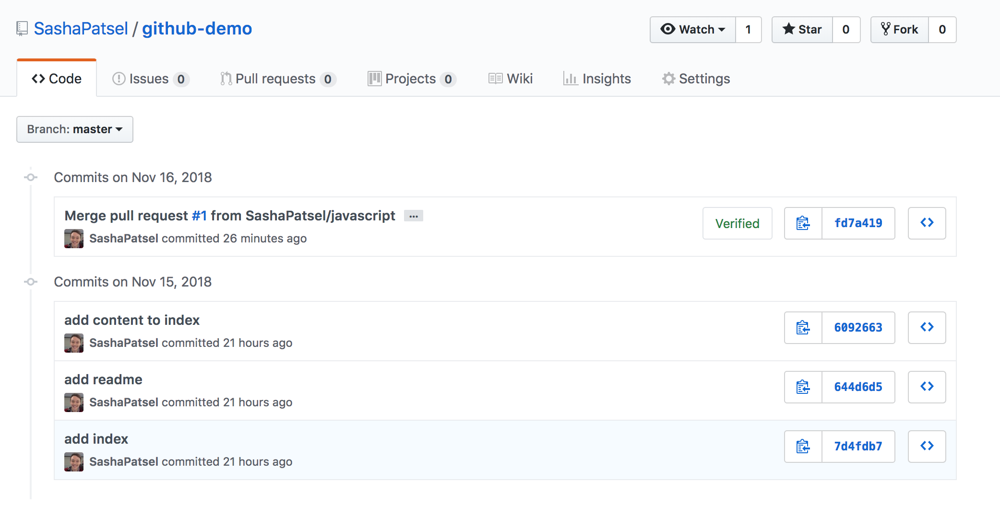

[Back](../README.md)
# Git

## Working with teams using git


## Table of Contents

1. [Introduction](#introduction)

2. [Setting Up](#setting-up)

3. [Branches](#branches)

4. [Pull Requests](#pull-requests)

5. [Pulling from Master](#pulling-from-master)

6. [Best Practices](#best-practices)

7. [Starting a Project](#starting-a-project)

8. [Stubbing](#stubbing)

9. [Separate Files](#separate-files)


### Introduction
Github can be at times an incredibly useful tool, at other times, it can be very frustrating--especially when collaborating on the same repository with others.

In this guide, we'll be covering topics from the basics of working with git in teams, to best practices that can help you use github seamlessly.

Without further ado, let's start from the top.

### Setting Up
Before we write any code, every person in your group should have access to the same project. 

- Create a new repo for your project if you haven't already. We will only need to create this project on one person's github. Delegate one member to host the group's project on their github.

- Once the repo is created, visit the main page for the new repository. Towards the top of the page, you'll find a tab called `settings`. Click on settings.



- Towards the left of the screen, after you've hit settings, you'll see a tab `collaborators`. Click on it.



- Once you've clicked on the `collaborators` tab, you'll see an input. Enter all of your team members github usernames, full names or email address into this input one at a time. This should send each member in your group an email invite.



- What the above steps do is allow your group members access to work on the original repo. Normally when you clone down another's repository, you will not be able to push up to it (though you can pull new content down). Adding collaborators will allow everyone in the group to push to the original repository even though it is not on their own github.

### Branches
If you've been working on projects with github alone. You should be very used to the following: `git push origin master`. What you're doing here is actually a specific set of instructions. You are pushing your changes up to a single, specific branch. That branch happens to be called `master`.

`You do not need to push your changes directly to the master branch`. In fact, you actively want to `avoid` doing so when you are working as a member in a group. 

`Each member in your group should be working in their own respective branch(es)`. This is essential.

Github is great because it is very careful about not letting collaborators overwrite each other's work.

Github is also frustrating because it is very careful about not letting collaborators overwrite each other's work.

So long as you follow best practices, you should be able to keep github working smoothly and only as a super-friendly tool. Use a flawed work flow, and github will give you headaches. 

`Have everyone in your group clone down the repository from whoever's github is hosting it.`

Once you have done so, navigate to that repo from the command line.  

Before you proceed, delegate roles for everyone to work on in your group. Refer [here](#starting-a-project) for more information. 

From the root of the repository in the command line, have everyone type in the following command: `git branch <BRANCH NAME>`. Remember, <BRANCH NAME> is a stand in for what you will actually name your branch. In this case, everyone should replace <BRANCH NAME> with whatever feature/role you've all agreed they'll be working in. If you were not able to delegate roles at this point, it is ok, for now, to simply have each group member's name be a stand in. For example:
`git branch joe`

Once you've run the above command, you'll notice that it still says `[master]` in terminal/bash. This is because all you have done is create the branch. You have not yet checked out to that branch. This is working very similarly to `mkdir`. When you create a directory/folder from the command line, you have only created that folder. You still need to "cd" to that folder to work within it.

The equivalent to that `cd` in git is `git checkout <BRANCH NAME>`. Run this command with the appropriate branch name, and you should see that the branch you created will replace `[master]` in terminal/bash.

In sum:



Notice the change in branch name between hard brackets on the command line.

### Pull Requests

When you and your group members create separate branches, you are creating `separate commit histories`. Until you `merge` (we'll talk more about this soon), you will not see your group members' updates. You are working in separate branches so that you can all work on the same project without ruining/overwriting each other's work.

When working in your own branch, your interactions with github will look like this:



Note that we are no longer pushing to master. Rather we are pushing to the branch we created. In this case, it is a branch called javascript. It can be named anything, but a best practice is to name your branches after features. 

When you push to a branch, you are pushing to only that branch. In other words, if I push to `javascript`, the changes I made will not be reflected in `master`.

To merge your changes to master, you will need to create a pull request.

You may notice that after you push to your branch, your github's project page might look a little different. 



Once you click on the button circled above, you should see the following page. 



There are two things circled on the screenshot above. The first is great news: `"Able to merge"`. This means that there is no conflict between the content in the javascript branch and in the master branch. To be clear, javascript can add to or remove from what was originally in the master branch. What would stop us from being able to merge would be if someone wanted to change something we had just changed. Github, being impartial, would not take sides in the conflict.

Thankfully, if we are unable to merge for whatever reason, github will also provide an interface for you to see the discrepencies in the code, and to resolve them directly.

The second thing that is circled is the `create pull request` button. If you're prepared to add your content to the master branch, go ahead and click this button.

That will take you to this page:



When you click on the button above, it will ask you to confirm whether or not you want to merge the pull request. As always, github is being extremely careful with merging work from different collaborators. If you are sure you want to update the master branch with your latest changes, go ahead and hit `confirm` after you click the `Merge pull request` button.

CONGRATULATIONS! If everything went just as lined out in the instructions above, you have successfully merged a pull request to the master branch.

However, there are some important things to understand while merging pull request. The first, and perhaps most important, is the nature of the master branch:

- The `master` branch is meant to represent the best available working model of your group's project. `You should not merge broken/disfunctional/under-development code to the master branch`. 

- You can push up to your branch as many times as you'd like before merging. Continually save your changes with github, and then merge when you have a working change to submit.

- You should `not` merge your own pull requests. This is in fact why it is called a request. Though you can merge your own pull request (a feature which you can change in github's setting), it is not the best practice. The idea is that you are `requesting` to update the team's work with your latest, working changes. Therefore, a group member should review your changes before they're merged.


- As you can see here, the commit history for the entire project is updated after the merging of the pull request:




### Pulling from Master
So at this point, everyone in the group should be able to create their own branches, work in those branches, and submit their changes to the master branch.

What's still missing is everyone else in the group receiving those changes on their own device. This is where you will need to do a `git pull`. 

From their own branches, everyone in the group can run `git pull origin master` from the command line. This will update everyone's respective branches with the latest content that has been merged with the master branch. 

`Merge conflicts` can arise often if you're not careful. They can be quite annoying to deal with sometimes. One of the best ways to avoid these conflicts is by making sure that everyone is consistent about updating their own local content. Therefore, when a pull request is merged to master, it is best if the entire group is notified. Each member should temporarily stop their work, and accept the new change. The more often this is done, the less likely your group is to run into merge conflicts. 

## Best Practices

### Starting a Project

New projects in software are extremely diverse. From the scope of the project to the languages being used to build it, there are almost infinite variations on how a group can start a project together. 

With that being said, there are still some best practices that any group starting a project together with github can follow. 

1. The project itself should be thought of first. What will it do? Who will use it? What will it look like? What technologies will it be built with? Hammer out all of these details before you proceed with any code. 

2. Next up, decide the roles for each member of your group. Who will work on what? Where does each group member's strenghts lie? Define these roles as clearly as you possibly can in these early stages of your project. 

3. If you've finished the above steps, your group should be able to agree on a file structure. Take some time to carefully consider what folders/files your project will need. Once you've decides on that, `the person who is hosting the project on their github should build out that file structure on the master branch before any pull requests are made`.

4. Think of the most basic aspects of the project. Will their be components/snippets of code multiple team members will need to work with? If so, build these out together, so that each member can in turn work independently.

### Stubbing  

Stubbing is one of the best techniques for avoiding merge conflicts. It is also great for clearly defining roles. 

In the most simple terms, `a merge confilct occurs when two or more members of a group simultaneously make different changes to the same thing`.

Stubbing avoids this problem by clearly staking out territories for each group member to work in. The idea is that if each member is working in their own space, it will be impossible for two people to change the same thing. 

Stubbing looks like this:


```javascript

//   ======================== GROUP MEMBER 1 WORK AREA ========================

// Group member 1, and only group member 1, writes code here

// ============================================================================


//   ======================== GROUP MEMBER 2 WORK AREA ========================

// Group member 2, and only group member 2, writes code here

// ============================================================================


//   ======================== GROUP MEMBER 3 WORK AREA ========================

// Group member 3, and only group member 3, writes code here

// ============================================================================

```

It is called stubbing because each group member is staking out a "stub" to work in. Each group member may only work within their designated stubs. Work in someone else's stub, and you're almost guaranteed to run into a merge conflict. 

### Separate files

The key reason stubbing work is because each member of the group has their own space to work in. Therefore, it is impossible to overwrite another's work. Another tool you may want to use in addition to stubbing is working in separate files. This also ensures that overwriting another's work is impossible. 

Rather than designating stubs for individual members to work within, simply designate files. 

It is best to use both the separate file and stubbing strategies together. In many cases, group members can comfortably work in seprate files. However, sometimes programmers' areas of interests will inevitably overlap when working together on an app. In that case identify what files that overlap will be affected by, and comment stubs out within the files concerned.

The most important takeaway from the best practices mentioned here is the pivotal nature of `planning`. Your group needs to be in constant communication.

At any given time a group member should be able to know what files their fellow group members are working in. If someone needs to work in new/different file, he/she should let the rest of his/her team know before he/she does so. 