# Using Gitlab

[Back to Home](../../../README.md)

 

### This will be a tutorial on how to utilise the gitlab repository and how to grab the updated class material everyday. There will be 3 sections in this tutorial:

* [The first section](##Updating-and-using-a-Gitlab-repository) will be for updating and using a repository you have already downloaded. 
* [The second section](##Resolving-errors) will be for resolving and solving errors you run across.
* [The third section](##Downloading-the-repository) is for downloading the repository for the first time or if you ran into an error and need to reset your repository

### Please ensure you carefully follow all the steps in the first section to avoid running into errors.

 

## Updating and using a Gitlab repository

1. Navigate to the folder you cloned down from Gitlab inside your terminal. You must be inside the folder for the next step. If you don't have the folder already cloned down, please refer to the guide for downloading the repository](##Downloading-the-repository)Remember this is the folder that was generated when you used the `git clone` command on the url we copied from Gitlab.

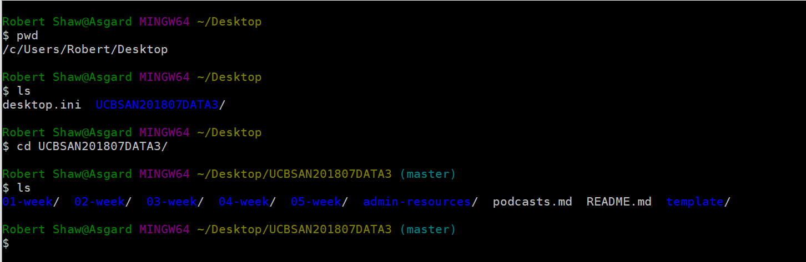

2. Once you're inside the folder, you should be able to `git pull origin master`. This pulls all the updated files down from Github. When you pull, make sure you get one of the two following messages and not an error message of some sort:

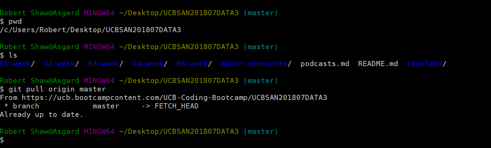

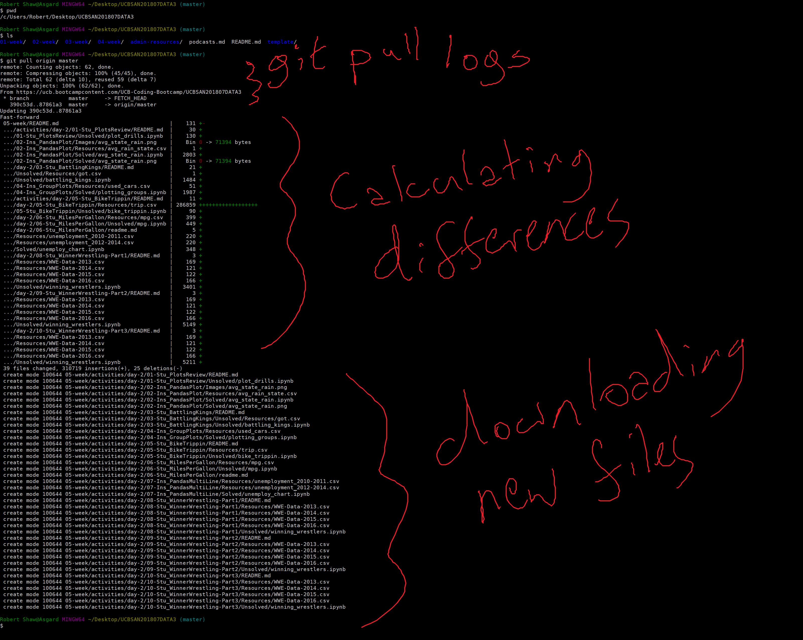

If you receive an error (Most likely a merge conflict), then please refer to the [resolving errors section](##Resolving-errors) for instructions. There are unfortunately quite a few different errors, but one of the most common ones is a merge conflict:

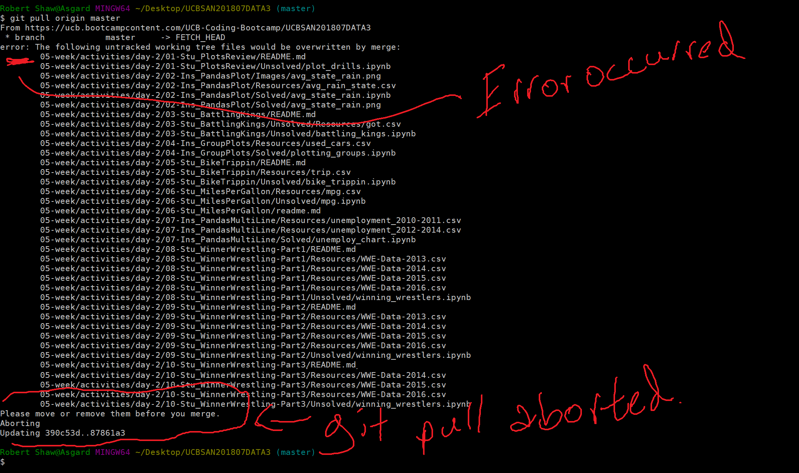

3. After we've successfully pulled from master, we need to COPY the files from the repository to a working directory. This working directory is where you will keep all the class activities and code drills you work on. If you work on the files in the repository, there will be a merge conflict or another error the next time you try to pull from master.

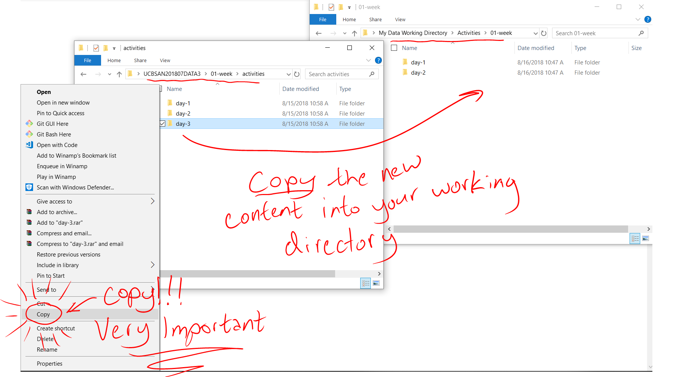

4. Now that we've copied the files into a new directory, we're ready to start working! Remember to work with those new files and not the repository.

 

## Resolving errors

1. Until we learn to deal with merge conflicts or get more practice with Git, the best way to handle errors when pulling down from master is simply to delete the repository and clone it down again.

    * Delete the repository

    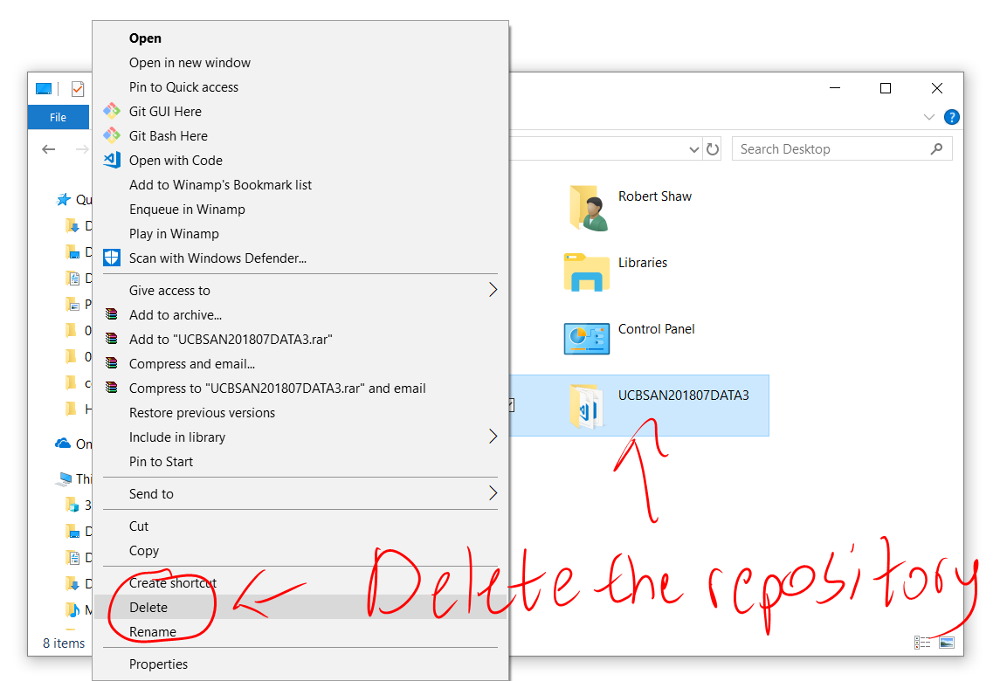

    * The follow the instructions to [clone down the repository](##Downloading-the-repository)

    * Remember to copy the files afterwards to a working directory so you're not modifying the files in the directory you cloned down. 

 

## Downloading the repository

1. Navigate to your gitlab. It should look something like this: 

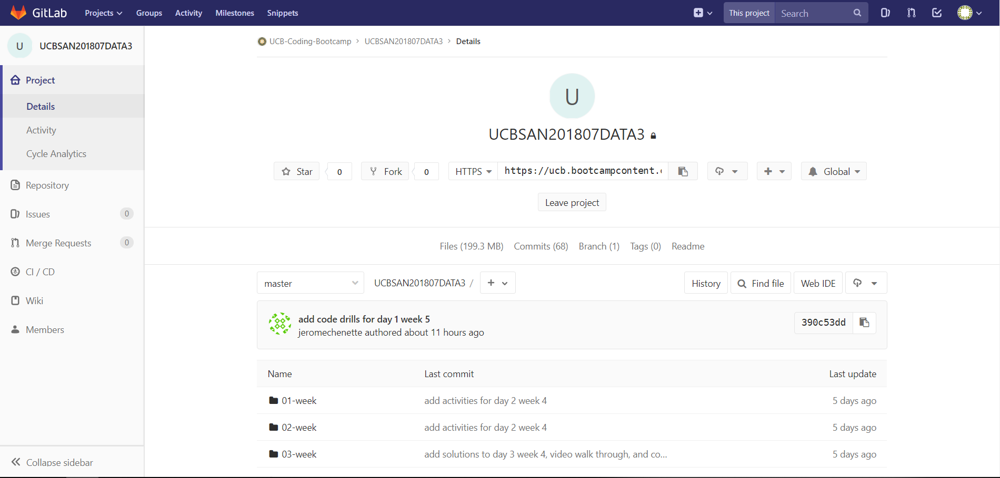

    * If your screen does not look like the screenshot, You can navigate back to that page by clicking this link:
    
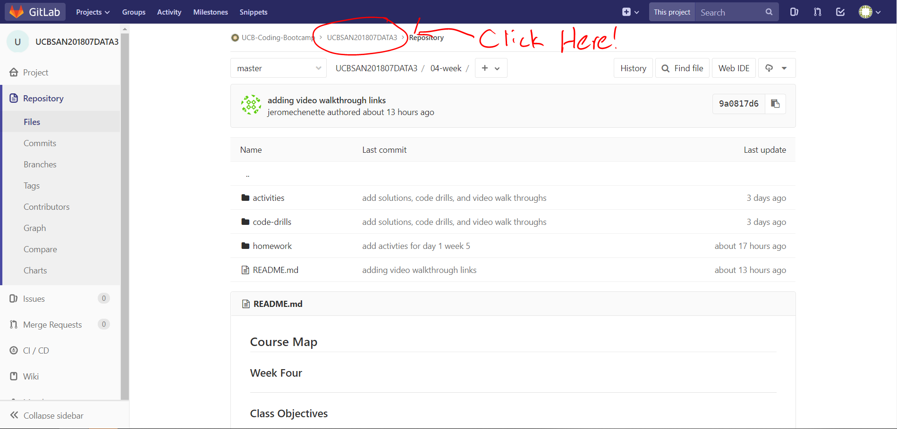

 

2. Then, copy the git clone link here: 

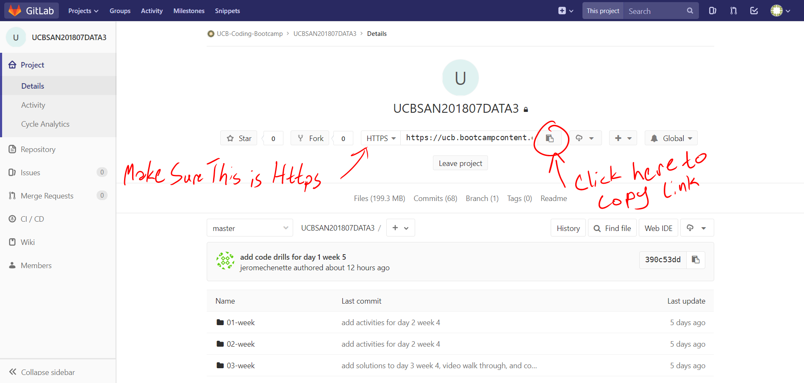

 

3. Navigate to your Desktop or any other easily accessible directory. We are going to be storing the folder here, and we will need to navigate here through the terminal regularly, so keep it somewhere easy to get to!

 

4. Then, use the `git clone` command with the link we copied in step 2: 

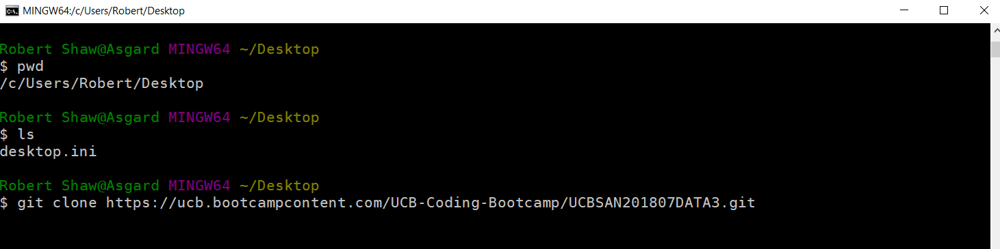

    * This will copy down all the current class material

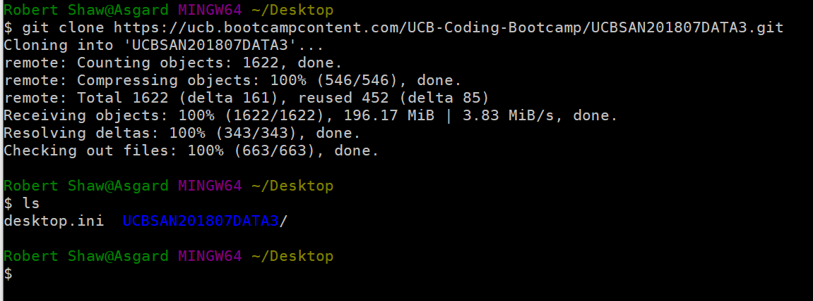

    * Since we are downloading the entirety of the class material this will take longer and longer as we get deeper into the class. So, we will be maintaining this repository instead of downloading everything again and again.

5. Once you have finished downloading the repository, you are free to navigate inside the folder and follow the instructions given in section one for updating and creating working directories.

 