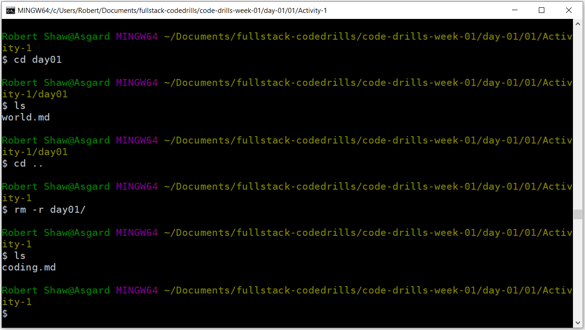

# Getting familiar with the Terminal #

### In this activity, we're going to be practicing a bit more with terminal commands. ###

1. To start with, let's open up the terminal in this folder.

2. Let's see what's in the folder! Use the `ls` command to see the contents of this folder.

3. What's the current path we're in? Let's find out with the `pwd` command.

    Notice that the path you're currently at is the folder where you right clicked to start git bash.

4. Make a new directory named `Activity-1` and then list the contents of the current directory again to make sure it worked.

5. Navigate into the directory we just made.

6. Make a new file named `hello.md` and then list the contents of the current directory again.

7. Copy the file you just made to a filed named `world.md`.

8. Rename the `hello.md` file to `coding.md`.

9. Make a new directory named `day01`.

10. Move the `world.md` file into the `day01` folder we just made.

11. Delete the `day01` folder.

You're done! Play around in the terminal some more if you want to explore the commands in the cheatsheet provided in hints.