# Github Practice

## The Basics

> In this activity, we're going to be making a new project on GitHub and practicing the more commonly used Git commands

### Instructions

1. Navigate to your GitHub page and create a new respository under the respositories tab.

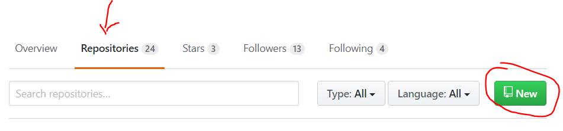

2. Create a new project named `coding-drills`. Add a short description to the project. We'll use

    > Coding drills for full stack bootcamp

    for this activity. Then, initialize the repository with a README and create the repository.

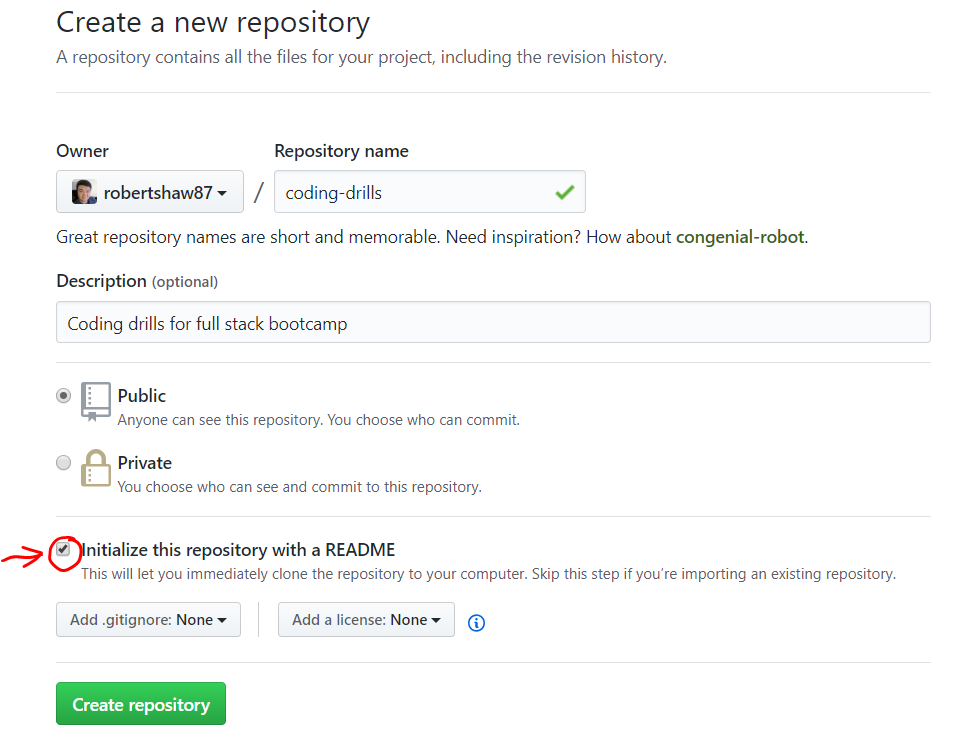

3. We will now be cloning down the repository we just made. Click the `Clone or download` button and then copy the link to your clipboard.

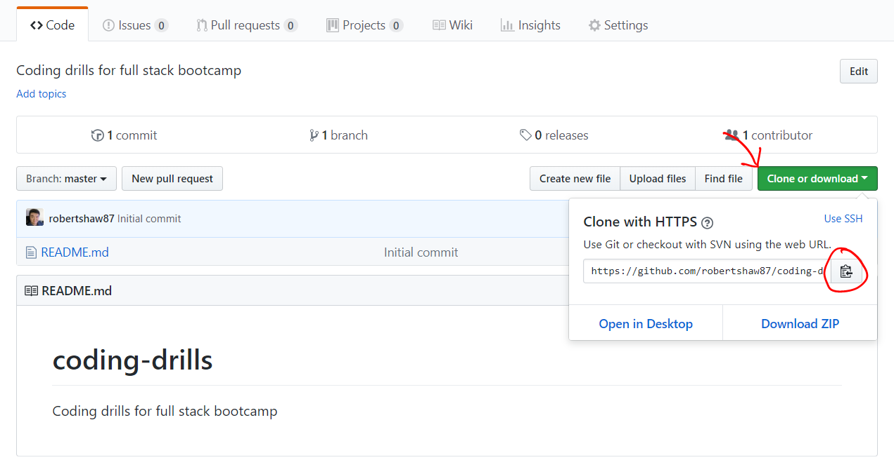

4. Now let's navigate to the directory you want to save your future coding drills into. This can be your desktop, your root directory, your My Documents folder, anything you want. Open up the GitBash terminal in this folder and then use the `git clone ` command with the link you've copied in order to make a local copy of the repository we just made.

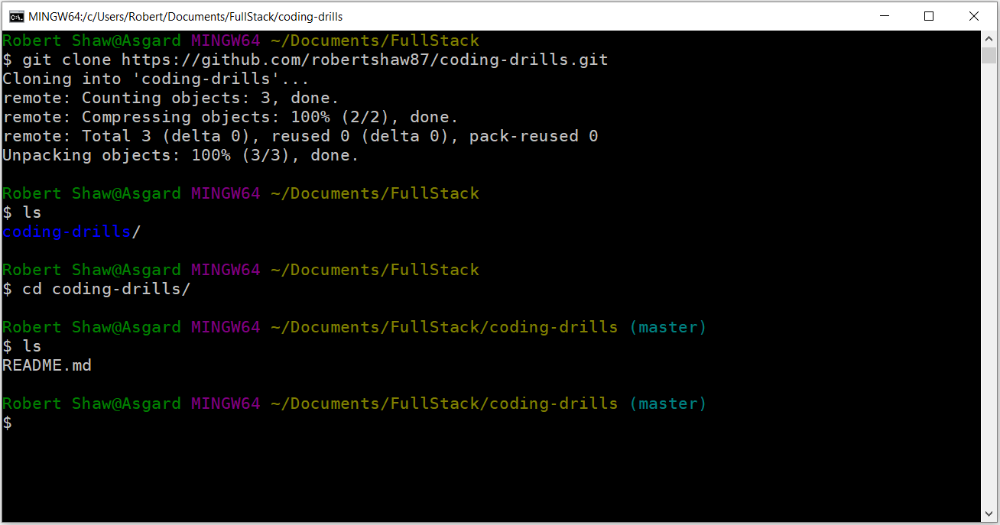

5. Check the current git status with a `git status` command. This should say we're completely up to date.

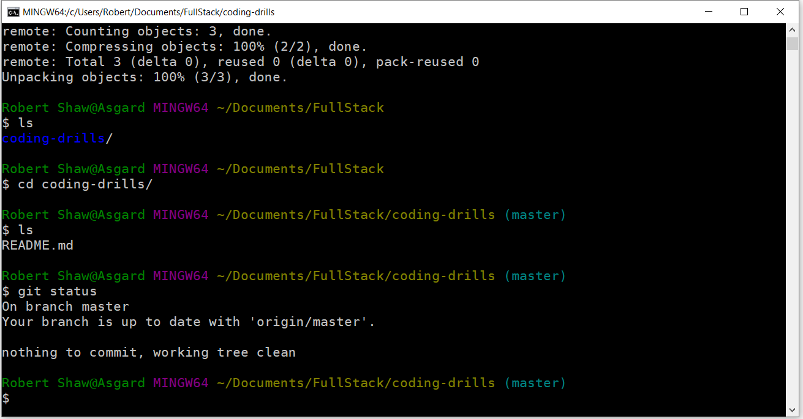

6. Make a new file called `test.md` and then check your `git status` again. Notice that git is now telling us we have an untracked file.

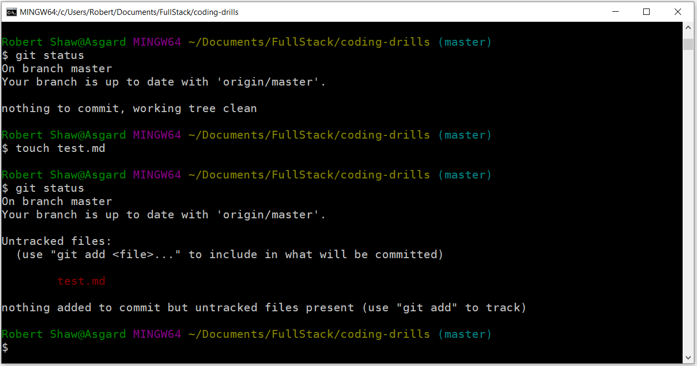

7. Add the contents of the current folder to be tracked by git with the `git add .` command. The period by itself references the current directory. Now git is waiting for those files to be committed.

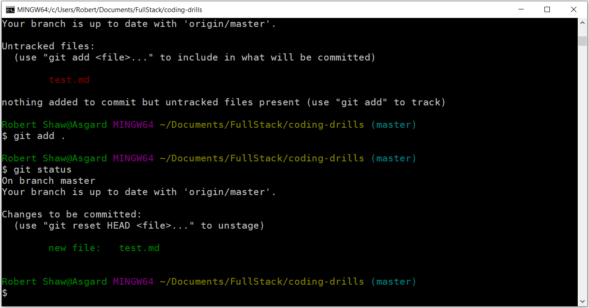

8. Commit the changes we've made to the repository along with a commit message with the `git commit -m "add test file"` command. This creates a new commit with the "add test file" commit message.

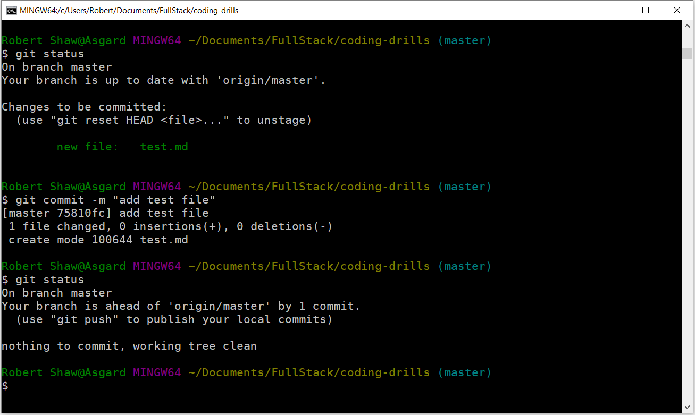

9. Now that we've committed the changes, we need to push it up to GitHub to sync our machine with GitHub. Use the `git push origin master` command.

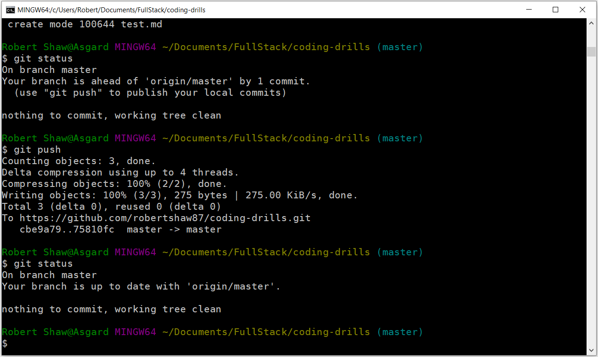

10. If we had made changes to our repository on another computer, we can pull down the changes we've committed with the `git pull origin master` command. Since we haven't made any changes yet, git will tell us that we're already up to date.

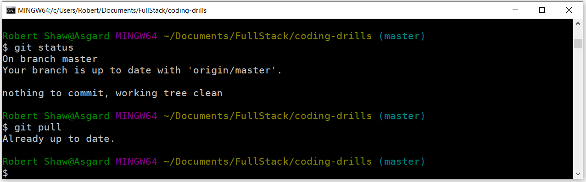

11. If we wanted to work on our project on another computer or from a different location, we can clone down the repository from GitHub much like how we did in step 4.

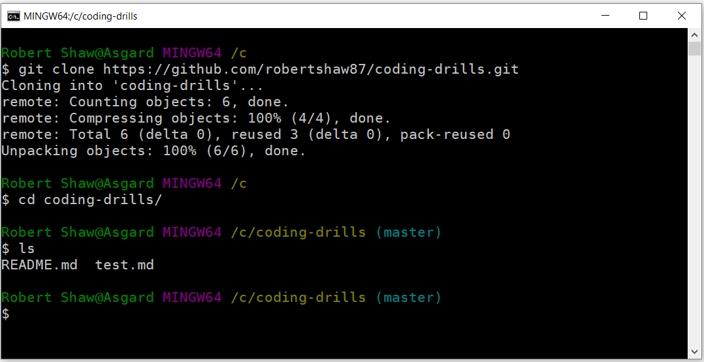

12. From our new location, we can make changes to the project and push those changes up to GitHub.

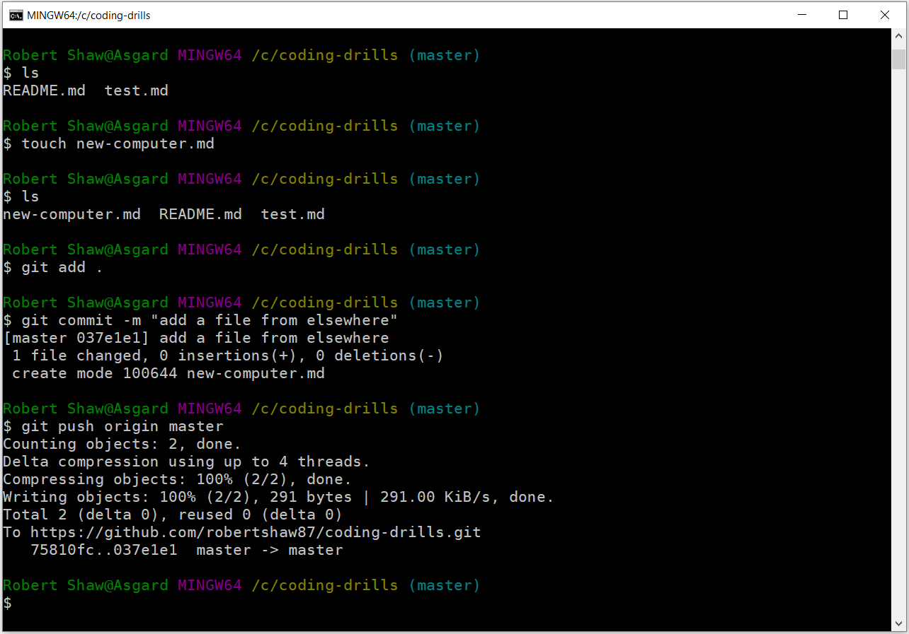

13. Now, if we go back to our first directory, we can pull down the changes we made elsewhere. Navigate back to the directory we cloned down in step 4 and `git pull origin master`.

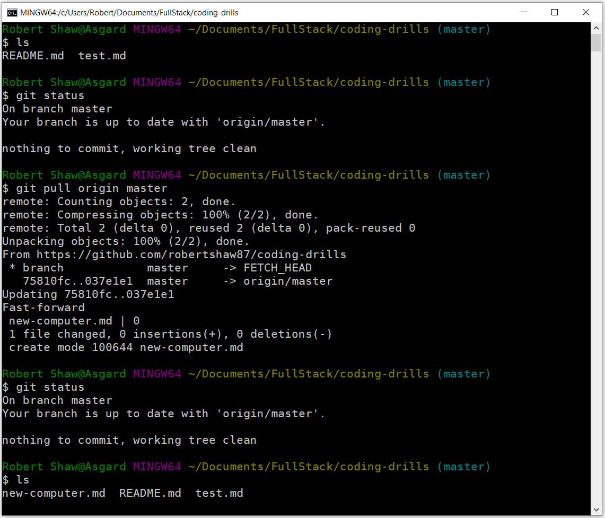

Git is a great resource for managing your code and very convenient if you want to change computers. You'll become very familiar with git and GitHub during the course of this class.
