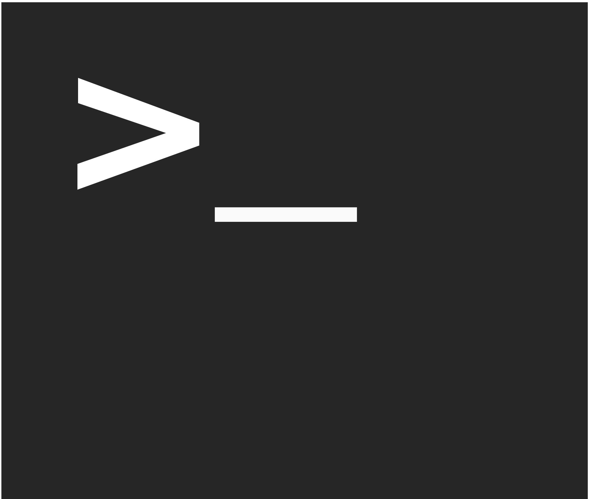
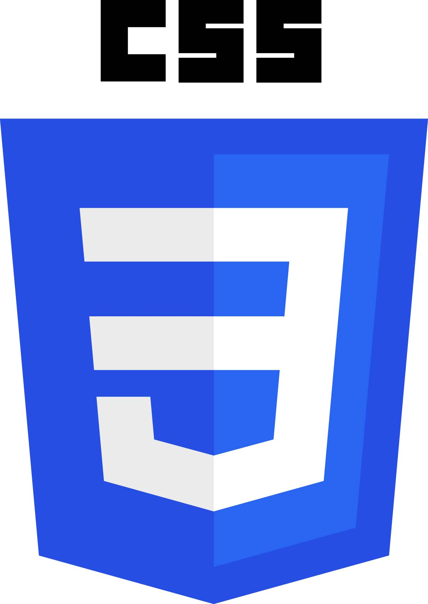

# Student Resources
[Return to HTML Git CSS](../../../README.md#html-git-css)

## Table of Contents

### Terminology & Links

01. [Command Line](#command-line)
02. [Git / Github](#git-github)
03. [HTML Tags](#html-tags)
04. [Box Model](#box-model)
05. [CSS](#css)
06. [Floats](#floats)
07. [Classes](#classes)
08. [IDs](#ids)
09. [Positioning](#positioning)
10. [Dev Tools](#dev-tools)
11. [Markdown](#markdown)  
12. [Softer Skills](#softer-skills)
13. [Misc.](#misc.)

### General Resources
01. [Uploading to Github](pdf/GitHub-Help/Steps-To-Upload-to-Github.pdf)
02. [HTML5 Sectioning Flowchart](pdf/html5-sectioning-flowchart.pdf)

### Audio Resources
01. [Podcasts](./podcasts.md)

<!-- ### Video Resources
01. [Video Listing](//video.md) -->

<h1>

 Command Line
 </h1>

[Back to top](#student-resources)

* Bash (Born Again Shell)

Text-based command language to access to your entire computer for everything from installations, to updates, creating files and removing the. It is what your desktop and all its graphics, icons, mouse clicks and finder/explorer are doing behind the scenes but much more powerful and direct.

* Console/Terminal/Command Line/Bash Shell/Zsh/Whatever

The text based window (a shell)  for executing bash commands on your computer of choice. Pick whichever you are most comfortable with that plays nice with your operating system.

##### Bash / Terminal Commands

`cd` (changes directory)
> the command to Change Directories (folders). remember to follow your cd command with the name of the directory, or use a .. ( two periods ) to go backwards out of the current folder.

`cd ~` (changes to home directory)

`cd ..` (moves up one directory)

`ls` (lists files in folder)
> the command to LIST the files and directories at your current location

`pwd` (shows current directory)
> the command to PRINT CURRENT DIRECTORY. this will show you where your current location is in (terminal/console/etc)

`mkdir <FOLDERNAME>` (creates new directory)
>the command to create FOLDERS (directories) on your machine

`touch <FILENAME>` (creates a file)
> the command to create FILES on your machine (remember to specify type like .txt, .html, .js, .whatevs

`rm <FILENAME>` (deletes file)
> the command to remove FILES

`rm -r <FOLDERNAME>` (deletes a folder, note the -r)
> the command to recursively ( -r ) remove DIRECTORIES (folders). the -r (recursive) lets your computer know to remove the folder, and everything that is inside of it.

`open .` (opens the current folder. MAC SPECIFIC)

`open <FILENAME>` (opens a specific file. MAC SPECIFIC)

`explorer <FILENAME>` (opens the specific file. BASH SPECIFIC)

`explorer .` (opens the current folder. BASH SPECIFIC)

**Autocomplete a File Name in the Current Directory**

Press `tab` key once to autocomplete once you have typed a unique portion of a file name.

**Mac Only**

**Open file or folder (Mac only)**

`open [name of file]`

**Open all files and folder in current directory (Mac only)**

`open .`

**PC Only**

**Open file or folder (PC only)**

`explorer [name of file]`

**Open all files and folder in current directory (PC Only)**

`explorer .`

#### Command Line Links

  * [Command Line Crash Course](https://learnpythonthehardway.org/book/appendixa.html)

<h1>

 Git & Github
 </h1>

[Back to top](#student-resources)

* Git

A version control system. Much like saving a current essay you are writing so you don't lose your work, Git also stores your past saves so you can revert to a previous version at any time, in case your latest version is broke EVERYTHING and you need to start your game from the last checkpoint, or if the latest idea you had didn't work out. Git Got You.

* Github

A web based version of Git that hosts your files and versions on the "cloud" (in GitHub's basement) so you can have multiple people working on the same project from anywhere, and a safety net in case all of your teammates somehow lose all their laptops and hard drives at the same time.

* SSH

Secure Shell. A super secure protocol for passing information over connections that are not necessarily secure. Through SSH you can safely execute or communicate bash scripts on another computer that is also connected to the internet wherever it may be physically located around the world. For instance, using SSH to "log in", and make changes to your GitHub repository from your computer to theirs (Git Push!)

* RSA

A security system to secure data transmission (such as over SSH). It is based on both the sender and the receiver having a paired set of keys (think BFF necklaces or a secret handshake). Once both sides are set up, both machines trust each other and allow the connection/changes

**GitHub Commands**

git clone – copies an entire repo (to begin).
> the GIT command to make an exact copy of a git repo (directory hosted somewhere else) on to your machine. You usually only need to do this once after creating a new repo initially, after you use git pull (see below)

git add – adds a file for inclusion in Git.

git commit – notes a change to the local repo.

git push – sends changes to hosting service.

git pull – downloads freshest version of repo.
> the GIT command to update your local (your computer's) version controlled directory from the remote repository. For instance, if your teammate made changes last night to your shared repo, you would not need to clone down the directory again, just git pull, and all of the new changes that they git (added, committed, and pushed) will be pulled down to your local machine and update your folder.

git status
> the GIT command, that will only work if you are in a directory that is also version controlled to show the current status of that directory (if there are new files, changes to existing files or general differences between what is on YOUR machine and your repository which is probably on GitHub)

git add
> the GIT command, that will only work if you are in a directory that is also version controlled to specify what files to add from your machine in preparation for a new commit (and most likely a commit and push after that)

git commit
> the GIT command, that will only work if you are in a directory that is also version controlled, that will store whatever you just GIT added, along with a message (usually as to why you are adding/editing those files) to then be pushed.

git push
> the GIT command, that will only work if you are in a directory that is also version controlled, that will update the repository (from your local machine) with the changes or additions you have just added and committed

#### Git Links
  * [Code School Git Course](https://www.codeschool.com/courses/try-git)
  * [Oh shit, git! ;)](http://ohshitgit.com/)
  * [How to Write a Git Commit Message](https://chris.beams.io/posts/git-commit/)
  * [How not to be afraid of Git anymore](https://medium.freecodecamp.org/how-not-to-be-afraid-of-git-anymore-fe1da7415286)
  * [Git/Github](https://github.com/Multishifties/No-Nonsense-Github-Project)
  * [Visual Git Guide](http://marklodato.github.io/visual-git-guide/index-en.html)

<h1>

 HTML
 </h1>

 [Back to top](#student-resources)

* HTML

HyperText Markup Language, your most basic building blocks of the web. The blueprint and scaffolding for a website. With this you can specify the general layout and structure of a website.

* Tags (HTML)

Every distinct element that HTML knows how to deal with, such as \<h1>\ tags, \<body>\. \<header>\ and the works. There is a handful, so google the rest, but remember that MOST tags need to be closed (like so: \<body>\ \</body>\), with the closing tag (the one with the </a>) being below everything you are enclosing inside of it (wrapping). You can add classes and ID's to all tags, so feel free to CSS away. \
\
\)

* Attributes (HTML)

The shenanigans you place INSIDE your tags - to specify things like classes, href's, src's and the like.
Remember, attributes go in the OPENING tag (the first one, not the </> one)

* Content (HTML)

Text placed between tags (
Lol heres some paragraphs and such
) that will show up ON you webpage. Things inside the < > are attributes, anything between the <> and </> is content and will show (and be affected by the tags wrapping it)

* Indentation

Indentation (typesetting), is the placement of text farther to the right, or left, to separate it from surrounding text to indicate visually the program's structure and grouping. Do this, or Chi won't like you very much anymore.

* &lt ; || &gt ;

They're used to explicitly define less than and greater than symbols. If one wanted to type out <html> and not have it be a tag in the HTML, one would use them. An alternate way is to wrap the element around code to not run into that. &lt;  &gt;

#### HTML Links

  * [HTML Tags](http://www.w3schools.com/tags/)
  * [Jon Duckett HTML and CSS](https://www.academia.edu/31552563/Jon_Duckett_HTML_and_CSS_Design_and_Build_Websites.pdf)

  * [HTML5 Element Flowchart](http://html5doctor.com/downloads/h5d-sectioning-flowchart.pdf)
  * [List of HTML Self-Closing Tags](http://xahlee.info/js/html5_non-closing_tag.html)
  * [HTML Attributes](https://www.w3schools.com/html/html_attributes.asp)

#### Box Model

[Back to top](#student-resources)

Every element within HTML adheres to something known as the box model. The CSS box model is fundamental to the design and layout of every single page on the internet. Here are some articles that go further in depth on this topic:
* [W3 Schools](https://www.w3schools.com/css/css_boxmodel.asp)
* [Mozilla](https://developer.mozilla.org/en-US/docs/Learn/CSS/Introduction_to_CSS/Box_model)
* [CSS-Tricks](https://css-tricks.com/the-css-box-model/)

<h1>

  CSS
 </h1>

* CSS

[Back to top](#student-resources)

Cascading Style Sheet. This is how you make your barebones HTML prettier. Here is where you dictate things like font, colors, and other such stylistic aspects of your page. The Cascading part of its name refers to the fact that the browser reads it from top to bottom, so anything below will override anything specified above it. For instance, if at the top of your CSS file, you said all paragraphs are in red, size 9000 font, and below it later you said that JUST your concluding paragraph is in blue and tiny 8 point font, that last line will override the rest, leaving you with a mostly huge red page, and a tiiiiiiny blue concluding paragraph.

* Selectors (hooks)

how you specify, in you CSS file, WHICH part of your HTML that it will be altering the style of. This can be classes (.classiestClass) ID's (#hashTagForAnID) or html tags (h1's are red, h2's are blue, but my 
 tags are all green and I hate CSS too)

* color:

how to specify text color. You can learn more about color [here](https://www.quackit.com/css/css_color_codes.cfm)

* font-size: 

Surprise, its how to specify font size (in PX, % of parent Div, or vh (1% height of viewport(browser window)) or vw (1% width of viewport) plus or minus a handful of others. Yaaaay CSS.

* font-style 

how to set things like normal, italic or oblique

* font-weight 

setting your flavor of BOLD. In addition, some fonts can take a numerical value that dictates how thick or bold the font appears.

* padding 

adds space BETWEEN an element and ITS OWN border (this gives it space inside its own little bubble)

* margin 

adds space between ELEMENT and ITS SURROUNDING ELEMENTS. Elbow room. This pushes elements away from one another.

#### CSS Links

* [CSS Tricks](https://css-tricks.com/all-about-floats/)
* [Learn CSS Layouts](http://learn.shayhowe.com/html-css/positioning-content/)
* [Learn CSS Positioning](http://learn.shayhowe.com/advanced-html-css/detailed-css-positioning/)
* [CSS Positioning](http://learn.shayhowe.com/html-css/positioning-content/)
* [CSS Reset](https://meyerweb.com/eric/tools/css/reset/)
* [clear-fix](https://css-tricks.com/snippets/css/clear-fix/)
* [Pseudo Classes](https://developer.mozilla.org/en-US/docs/Web/CSS/Pseudo-classes)
* [Margin](https://www.w3schools.com/css/css_margin.asp)
* [WebSafe Fonts](https://www.w3schools.com/cssref/css_websafe_fonts.asp)
* [Semantic HTML](https://en.wikipedia.org/wiki/Semantic_HTML)

#### Floats

[Back to top](#student-resources)

Floats specify how elements should be placed inside of their container, be it to the left or right. They are helpful for allowing text to wrap around the element.

#### Classes

[Back to top](#student-resources)

Class selectors selects elements with a designated class attribute. They are usually denoted with a period `.` before the name of the class. Classes are helpful in styling multiple elements at once.

#### IDs

[Back to top](#student-resources)

Unlike classes, IDs are unqiue and are used to target a specific element. They are usually denoted with a pound symbol (or hashtags for the youngins) `#` followed the name of the ID.

#### Positioning

[Back to top](#student-resources)

* [W3 Schools](https://css-tricks.com/almanac/properties/p/position/)
* [CSS Tricks](https://css-tricks.com/almanac/properties/p/position/)

#### Dev Tools

[Back to top](#student-resources)

Developer tools are built into every web browser and allow us, as developers, to debug and test changes without altering our original code.

To access Developer tools, right click within your browser and select `inspect`
* MAC shortcut: ` ⌘ + Shift + C`
* PC shortcut: `Ctrl + Shift + C` or `F12`

<h1>

  Markdown
 </h1>

 [Back to top](#student-resources)

* .MD

MarkDown files. Text based files where you will usually find instructions, ReadMe's (fancy word for instructions), or homework guidelines (also instructions). If you find yourself lost, or guessing a LOT, make sure there isn't a .md somewhere near with kind, gentle words to guide you on your journey.

#### Markdown Links

  * [Markdown Cheatsheet](https://github.com/adam-p/markdown-here/wiki/Markdown-Cheatsheet)

#### Softer Skills

[Back to top](#student-resources)

* Tacit knowledge

[Tacit knowledge](https://en.wikipedia.org/wiki/Tacit_knowledge) (as opposed to formal, codified or explicit knowledge) is the kind of knowledge that is difficult to transfer to another person by means of writing it down or verbalizing it. For example, that London is in the United Kingdom is a piece of explicit knowledge that can be written down, transmitted, and understood by a recipient. However, the ability to speak a language, ride a bicycle, knead dough, play a musical instrument, or design and use complex equipment requires all sorts of knowledge that is not always known explicitly, even by expert practitioners, and which is difficult or impossible to explicitly transfer to other people.

* Impostor Syndrome

A feeling common to high achievers (such as yourself) (yes you) (no really, I promise) who are unable to internalize and accept their success, often attributing their accomplishments to luck rather than to ability, usually because they assume, incorrectly, that their more senior peers know everything when in reality everybody is experiencing this at the same time. (see? it's you.)

* Embracing the Confusion

It is the Zen of Coding. The secret to all success. Realizing that software evolves at an exponential rate, and that no human can possibly know, or retain everything that there is to know on the such a broad, open source subject that millions of people are contributing to and changing on a daily basis. One does not need to know all, one only needs to know how to learn. Seniority does not not equate to superior intellect, and if somebody can answer your question off the top of their head it is only because they spent hours upon hours fighting the same problem you face now.

* Google Fu

Your front line for problem solving. If you have an issue, chances are (and statistics would suggest) that hundreds, if not thousands of other people have hit the same bug. Phrasing your searches correctly, and learning to navigate sites like W3schools and Stack Overflow can solve 90% of issues you face.

**Learning To Learn**
  * [Google Fu](http://lmgtfy.com/?q=google+fu)

#### Misc.

[Back to top](#student-resources)

**Typography**
  * [16 Pixels Font Size: For Body Copy. Anything Less Is A Costly Mistake](https://www.smashingmagazine.com/2011/10/16-pixels-body-copy-anything-less-costly-mistake/)
  * [Line Length](http://baymard.com/blog/line-length-readability)
  * [Google Fonts](https://fonts.google.com/)
  * [Typeplate](http://typeplate.com/)

**Wireframing Tools**
  * [Balsamiq](https://balsamiq.com/)
  * [Framebox](http://framebox.org/)
  * [Balsamiq Mockups](https://balsamiq.com/products/mockups/)
  
 * [PLACEHOLDER.COM](https://placeholder.com/)
>Quick & simple image placeholders. 

* file paths

The location of another file, relative to the FILE YOU ARE WRITING THIS IN, of the other file you want to call. For instance, if your index.html is in your repo, and your CSS file is in the Assets folder, you would need to specify "./Assets/style.css" so your index page knows to go look in that folder for its stylesheet

  

