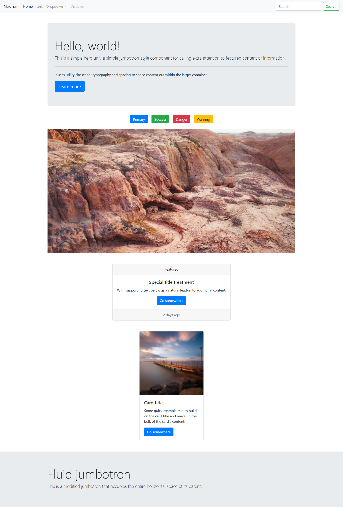

# Bootstrap

## Making a Webpage with Bootstrap Components

#### In this activity, we will be creating a basic Bootstrap webpage using the grid system and the components Bootstrap provides us. Remember to link Bootstrap! With Bootstrap, we can create the framework of a website quickly and then modify it to our needs later. For this activity, we will be creating a webpage that looks good without using any custom css.

#### Today, we will be making this webpage: ####


### Instructions

1. Create a new `index.html` file and populate it with the boilerplate header content. Let's title our new webpage `Bootstrap Bonanaza!`.

2. Navigate to the [Bootstrap Website](https://getBootstrap.com/) and link both the css and the javascript files. Remember to link the css file in the head of the html file. The JS links should go within the body tags after your code.

```
<body>
<!-- Your code goes here -->


<!-- End of your code -->

<!-- Link the Bootstrap JS files here -->
</body>
```

You will not have a custom css file for this activity.

3. Almost every website needs a navbar. Let's add one from the Bootstrap components!

4. When we get to the actual content of our webpage, wrapping everything inside a container will allow us to more easily control and customize the size of the content within our webpage.

    * Create a <div> that has the `container` class

    * Let's add a margin to the top of the container we just made to seperate it from the previous element. Add a `mt-5` class to the container. This is one of Bootstrap's many utility classes. It adds a (`m`)argin-(`t`)op to whatever element we add the class to. The number after the dash governs how large we want the margin to be.

5. Inside the container, add in a default jumbotron. Jumbotrons are a great way to provide main content that pops out at users.

6. After the jumbotron, make a wrapper element for the next part. A wrapper element is just a \<div> that we're going to be putting content into.

    * Add a `m-3` class to your wrapper element to seperate it from the previous element. unlike the `mt` class we used previously, just using the `m` class will define a margin on all sides of the element.

    * We want to center all the elements within our wrapper element to make it look nicer. To do that, we need to first make it a flex-box and then use the alignment utilities that Bootstrap gives us. Documentation can be found [here](https://getBootstrap.com/docs/4.1/utilities/flex/#justify-content).

7. Now that we've set up the wrapper element, let's put some buttons in there. Add in 4 buttons and use the Boostrap classes we've been using to add a margin around them.

8. The wrapper element allowed us to keep our buttons together while still centering them in the page. Now that we've done that, we can move on. Our future components will be outside the wrapper.

9. After the wrapper element containing our buttons, let's add in a carousel. Carousels are great for showcasing images we want for our webpage. For now, lets copy down the one from Bootstrap that has the controls.
    * Now that we've got a carousel in our page, we have to swap out their placeholder image links with our own. Use [this placeholder image site](https://placeimg.com/) to create placeholder images for our carousel. Make sure you use three different links in order to fully showcase the carousel!

10. Create another wrapper element for our next component and seperate it from the previous component. It won't take up the entire width of our page, so we're going to center the content within this wrapper again.

11. Put a card component inside the wrapper, and we're done with the wrapper.

12. Make another wrapper and card combo after the previous one.

13. Finally, let's add a fluid jumbotron to the bottom of the page, outside that wrapper container we'd made for the content. This will be the footer for our page!

14. You're done! If you made it to this point, you'll have created a webpage using nothing but bootstrap!