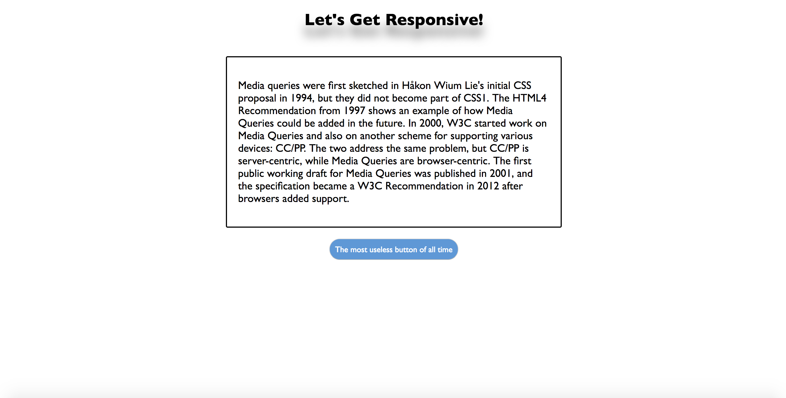
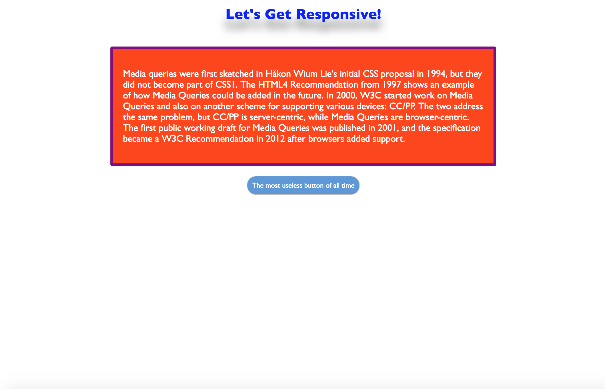
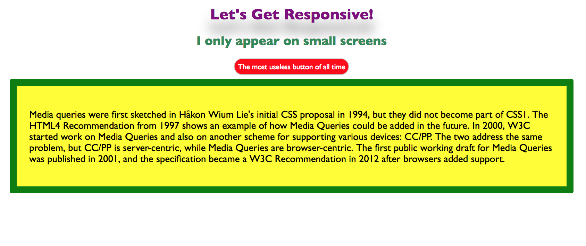
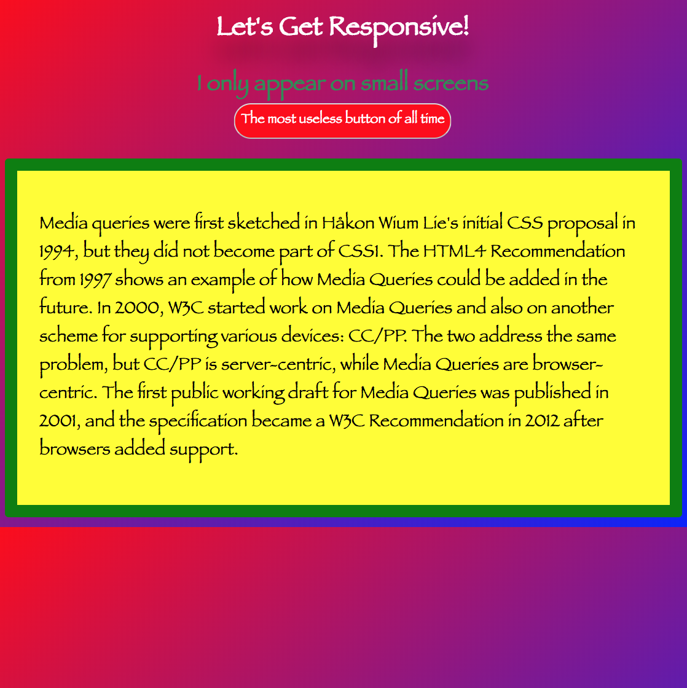

# Responsive Design

## Media Queries

### Instructions

Your goal in this exercise is to make this simple web page look different on screen widths of 1200px, 900px and 600px. Feel free to use your own colors in fonts when completing these exercises!

The main page in this exercise will be given to you. It looks like this: 

At 1200px of width, your page should look like this:

At 900px, it should look like this:

At 600px, it should look like this:

Do your best to make this page look like the above images at their respective screen sizes! You will find some instructions and hints inside your starter css file.