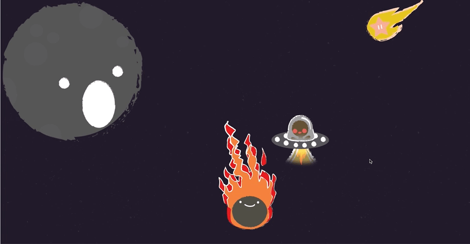

# CSS

## Fixed Position

Everybody knows it was a meteor that brought on the demise of the dinosaurs. Poor dinos! In this exercise you will get practice with positioning. Using CSS you will align the given images to create a story. The story of how the dinosaurs went bye bye.

You are provided a simple HTML page with images and will use an external css files to give the images properties in order to correctly align them. The provided files already have IDs correlating to each image.

### Instructions

* First and most importantly, let's create a link to the stylesheet
* Give the `sky` div the following properties:
    * a background image. Use the provided image inside the images folder named `background.png`
    * A width of `100%`
    * A height of `2000px`
    * `position: relative`
* Create a new class that sets a maximum width of 200px. Apply this class to every image except the moon
* Using absolute positioning, align the first alien slightly to the left and towards the bottom half of the `sky` div
    * Note: He should not be seen until you scroll down
* Align the second alien slightly to the center right but keep him slightly closer to the top of the page
* Align the star to the top right of the page
* Align the meteor to the center of the page and give it a fixed position
* Align the dinosaur to the bottom of the `sky` div
* Give the meteor a `z-index` of 2 and the dinosaur a `z-index` of 1

Once you are done it should look a little something like this:

Congrats! You have recreated the horrific destruction of the dinosaurs.

### Tips and Tricks
CSS position is usually foreign to most developers and some consider it *alien*. The trick is really just to play around with the values and percentages until it shows up where you want it on the screen.

Your end result doesn't need to 100% match the provided example! So have fun and play around with the positioning.