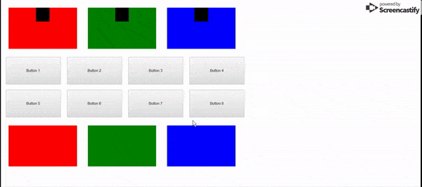
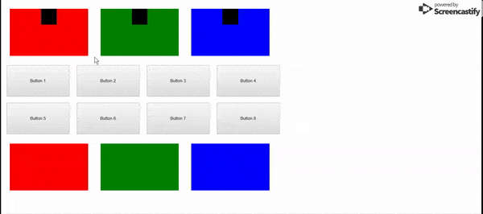
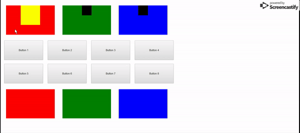
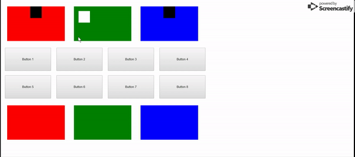

# CSS

## Pseudo Classes

_In this activity we're going to be reviewing pseudo classes. They can be used for more than just buttons and can be used to make some elements pop._

_You should not have to modify the html at all for this activity._

### Instructions

1. Float the boxes so there are three boxes in a row above the buttons and three below the buttons. Ignore the little black boxes inside the top row. They're there for the bonus!

2. Now that everything is floated, let's use the `hover` pseudo class to decrease the size of the first box on the bottom when we hover over it with the cursor

3. You can use the `active` pseudo class even on elements that aren't buttons! Let's set one for the second box on the bottom that gives it a large margin on the right when clicked.

4. Let's combine what we learned! Change the color when we hover over the third box on the bottom. Then make that box float to the right when clicked.

5. Let's make the buttons more exciting! Make the even numbered buttons (class `btn-even`) change height and width on hover. Then, make them change to yet another height and width when clicked on.

6. We can change any styling we want using these pseudo classes. Let's modify the odd numbered buttons. 
    * Change the color of the text and the background color when they're hovered over. And then add in styling so the border style, width, and color changes too when hovered. 
    * Use a different set of colors and values to set the text color, background color, border width, border color, and border style of the odd buttons when they're clicked.

#### Bonus ####
* Using the css *element element* selector, we're going to style the the .inside-box of a top box when the outside box is interacted with. Documentation for the select can be found [here](https://www.w3schools.com/cssref/sel_element_element.asp).

* Using a combination of pseudo classes and the selector, change the background-color, height, and width of the `inside-box` while the first top box is hovered over.

* Use the same technique to change the background color and margin of the box inside the second top box.

* We can even use other pseudo classes! Let's change the background color, margin, and float behavior of the box inside the third top box when the outer box is clicked.

* This is especially useful for when we're changing the size of an element, so the size change does not cause the mouse to no longer be on the element. This might cause your element to clicker between the two states. By having the change trigger by hovering on another element, the element we're resizing wont be affecting the hover trigger!