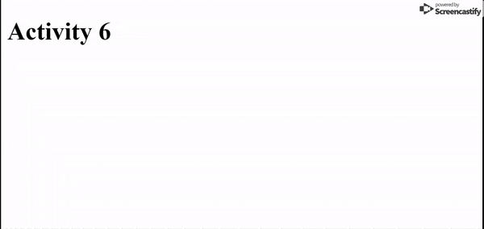

# Javascript

## Event Listeners Part 2

_We're going to be diving deeper into event listeners in this activity. Remember, if you want to store a variable for use later, it *must* be declared outside the function you're assigning to the even listener_

### Instructions

1. Create an html page and link your css file

2. Create an event listener that displays the key the user pressed on the webpage
    * Do not use an alert. Create a change in the content of a div on the actual webpage.

3. Add in a check to make sure the user pressed a key that a letter of the alphabet. If they did not, instead of displaying the key they pressed, display a message asking them to press a letter.

4. If the the button the user pressed is a letter, store that letter into an array and display that array into a different div on the webpage

