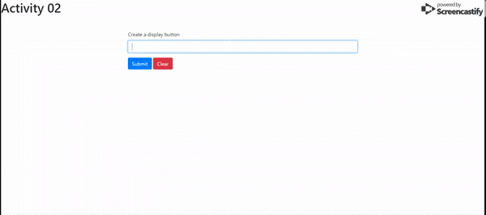

# JQuery

## Event Listeners and `this`

### In this activity, we're going to building a simple webpage that takes in a user's text input and creates a button with whatever they typed in when they submit. Then, when the user clicks on the newly created button, the text stored within that button is output to a display area.

### Instructions

* We've provided the html and a skeleton javascript file for you

    * Only code in the areas indicated. You should not have to modify anything outside of those three areas

    * If you need more guidance, there is pseudocode provided for you in the `hint` folder

