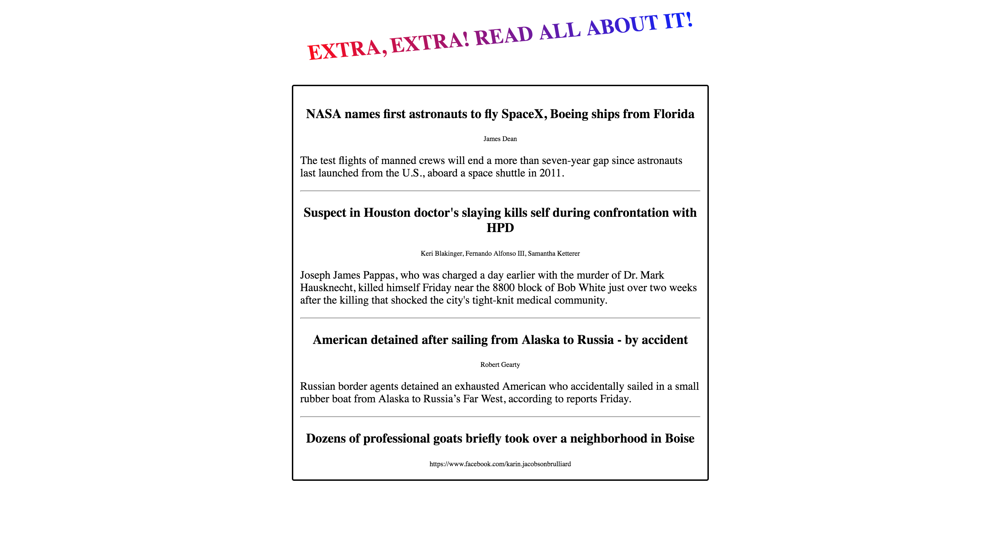

# APIs

## News API

### Instructions

### Step 1

Visit [this link](https://newsapi.org/) and sign up for an API key with newsAPI.org. 

### Step 2

Visit [this link](https://newsapi.org/docs/get-started) to do some reasearch on this API's documentation. 

Your job will be to find out how to get an API response giving us the top headlines in the US. 

## Step 3 

Make an AJAX call to the newsAPI API (that doesn't sound great). 

It is recommended to first console.log() the entire response to see what is coming back, and to get an idea of how to tackle the returned data.

### Proceed to prompt.html for the rest of the instructions (start at step 4)!

Scroll down towards the bottom until you find the  tag. You will find the rest of the instructions there. You will not need to manipulate the html or the css

#### You will know it worked when your page looks like this:

(You should be able to scroll through the news box for more stories)