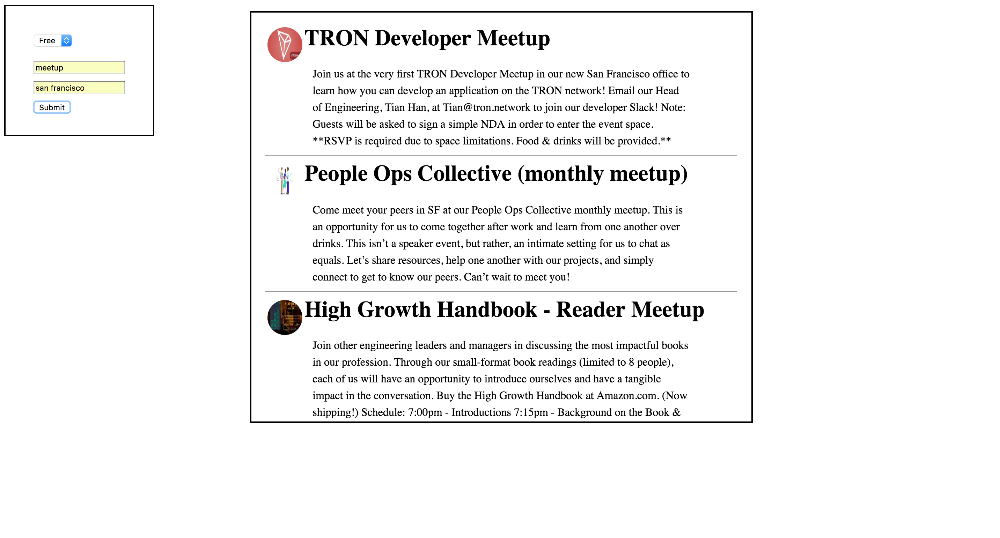

# APIs

## EventBrite

_Learn to use brand new APIs!_
We will be using a small form to get user data that we will then use to make a request to the eventbrite API.

Follow the steps below to make it happen!

### Instructions

### Step 1: Get your API key

Visit [this link](https://www.eventbrite.com/myaccount/apps/) to get your API key. When you open the form, don't worry about the fields like application website or description. You can paste any link or description. Once you hit `Create Key`, you should have all the credentials you need to use the eventbrite API.

Note: You will be using `Your Personal OAuth token` for this query

### Step 2
Visit [this link](https://www.eventbrite.com/developer/v3/endpoints/events/), and study the structure of the requests you can make to the eventbrite API. 

In this exercise, we will be making an app which allows the user to choose the location, category of event as well as the cost of the event. The queries included in our url (as per the documentation) are: 

- q
- location.address
- price

In step 2, you need to figure out how to make a proper request to the eventbrite API. 

Before you grab the values of the user input, try and make a request to this API with values you made up. It's important to first test that we can successfully query the eventbrite API before we move on to the next step.

Once the console.log(response) given to you comes back as a proper response, you'll know you've completed this step.

### Step 3
Once you've completed step 2, you've already overcome the biggest hurdle in this exercise. 

In step 3, you'll be concatenating the users' input into our query. The users' input should replace the values we put into the quesry ourselves. 

Fill out the form and see if you can get a response from the API with your new URL string.

You'll have finished when you get back a console.log() of response that seems pertinent to the values you entered into the form.

### Step 4
You will need to loop through an object nested within the response to grab a hold of the following values:

- The original logo for the event
- The name of the event
- The description of the event

Console.log all of these values for each event returned to you. 

### Step 5

Now it's time to render our response to the page. 

Instead of console.log()(ing) these values, we will append them to a div found within the div with the class of apiReturns.

Within your loop, concatenate the same values you console.log()(ed) in the last step into an HTML string with the following format:

```
'<div class="eventPic-holder"></div><h1 class="eventName"></h1><p class="eventText"></p><hr>'

```

- The logo will go into the src attribute of the image tag.
- The name will go inside of the h1 tag
- The description of the event will go inside the p tag.

#### Your final product should look like this: 

