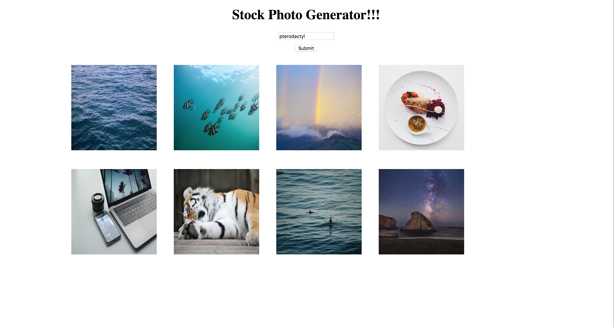

# APIs

## Unsplash

_Learn to use brand new APIs!_

### Instructions

#### Step 1

Get your API key! Visit [this link](https://unsplash.com/developers) to sign up with unsplash.
_Learn to use brand new APIs!_

_Learn to use brand new APIs!_

#### Step 2
Once you've signed up, return to the above link, and click on the black `your apps` button on the left hand side of the screen.

Once you've navigated to the next page, click on the `New Application` box with the dashed border.

Accept the terms. Once you've done so, a popup should appear asking for an application name and description. Just fill in whatever comes to mind. This won't matter.

Once you've hit submit on the popup, you'll be brought to a new page with information about your app. If you scroll down a bit on that page, you'll find the keys you need to access this API.

#### Step 3
With your keys in hand, it's now time to learn how to query this API.

Go to [this link](https://unsplash.com/documentation) and read up on the documentation.

Specifically, you are looking to find how to return a random photo limited only by a search term.

#### Step 4

You are given no code in this exercise aside from the ajax prefilter (again, used to avouid cross-origin errors).

Your job is to grab the users' input and use it as a search term to limit the random photo return. 

Once you've gotten a return (which should only contain information for one photo), append it to the div with the class of `holder`. Make sure that you give your img tag the class `img`.

Your final product should look like this after the user has searched for a couple of photos:

