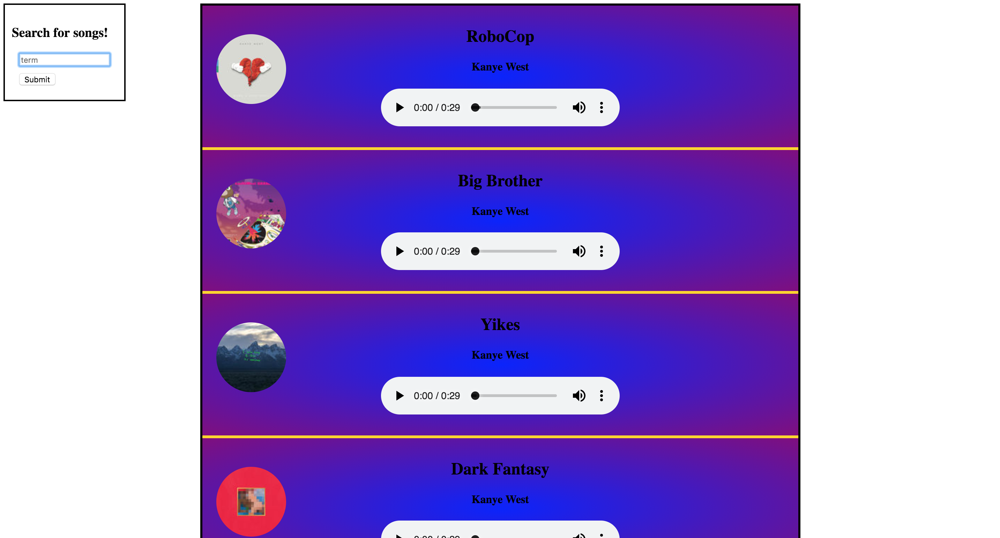

# APIs

## Itunes

_Learn to use brand new APIs!_


### Instructions

In this exercise will make an app that lets users create their very own itunes libraries (though comprised of previews).

#### Step 1
NO API KEY!!!!!!

Visit [this link](https://affiliate.itunes.apple.com/resources/documentation/itunes-store-web-service-search-api/#overview) and read up on the itunes API docs.

#### Step 2
Based on your research, query the itunes API for songs related to a search term of your own choosing.

Console.log() the results of your query

#### Step 3
If you were successful in step 2, you should see a gigantic string logged to the console of your app.

Not to worry, this is what we should be seeing. However, it would be far more challenging (even impractical) to parse through this string for the information we want.

You will need to `parse` this string so that we instead get JSON (JavaScript Object Notation) back. 

Move on to the next step when you have converted the giant string from step 2 into an object that you can see in your browser's console.

#### Step 4
Now that we have an object to work with, we can begin to search for the values we want. Create a loop which iterates through the results in your response. Console.log the following for each iteration of the loop: 

- The artwork (grab the highest quality photo, artworkUrl100) 
- The track name
- The artist's name
- And a url to preview the song

#### Step 5
Create an event listener for the submission of the form with the id of `itunes`. Within that function, grab a hold of the value of the user's input in the `<input>` with the id of `term`.

Console.log() the value you believe will work, and see if it matches what you typed into the input. Once you have successfully done so, move on.

#### Step 6
Use the value we retrieved in step 5, and concatenate it into the url we are using to query the itunes API. 

Remember, we want only the search term to change, but we are still interested in the songs related to that term.

#### Step 7
With the tools we've been accumulating over the past few steps, you should now be able to console.log an object returning information about songs relative to a search term input by the user. 

Now, we want to `prepend` (so that the latest query will be shown at the top) our values within the div with the class of library.

We will do so in the following format:

```
<div class="song">
  
  <h2 class="song-name"></h2>
  <h4 class="song-artist"></h4>
  <audio class="song-audio" src="" controls></audio>
</div>

```

- The artwork goes inside of the src attribute of the image tag
- The name of the song goes inside the h2 with the class of `song-name`
- The name of the artist goes inside the h4 with the class of `song-artist`
- The song preview goes inside of the src attribute of the audio tag

Your final product should look like this:

