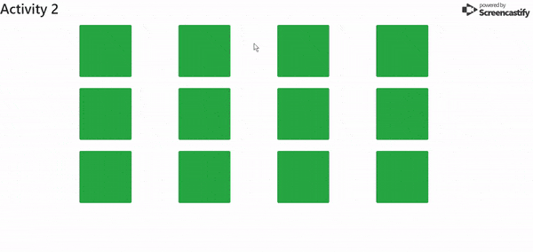

# Data Persistence

## Local Storage

### Instructions

_In this activity, you're going to be getting more practice with local storage and understanding more arcane data structures. Most of the code has been given to you, but the data is stored in a non-conventional way. Your task will be to both implement local storage so the state of the app is stored across sessions and to implement minor logic that uses functions that someone else wrote._

* There are comments throughout the code explaining what each section does, but you will probably have to dive into what has been written to understand how to integrate your code with what's already there

* You can try getting the app working the way you want it to first before implementing local storage.