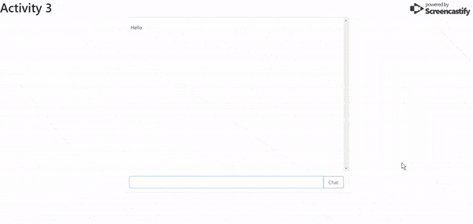

# Firebase

## Chat Feature

### Instructions

_In this activity, we're going to implementing a very simple anonymous chat program using Google Firebase. We will not be storing any usernames or other information, just the messages as the users send them. When a new user visits our page, they should be able to see all the previous messages we have stored._

* Create a new Firebase database for this code drill and link it at the bottom of the `index.html` we have provided.
    * You should be able to complete this activity without any other changes to the HTML

* When the user submits a chat message, store it inside Firebase with the `push` method instead of the `set` method.

* Set up a listener for a child being added in Firebase. You can read about the "child_added" listener [here](https://firebase.google.com/docs/database/admin/retrieve-data#child-added).

    * Append the child that was just added to the `chat-display` area

    * This listener will trigger each time a child that the client hasn't seen is present on the database. Which means when you initially connect to Firebase, this listener will trigger once for every entry stored inside our Firebase, thus letting us grab the chat history too!