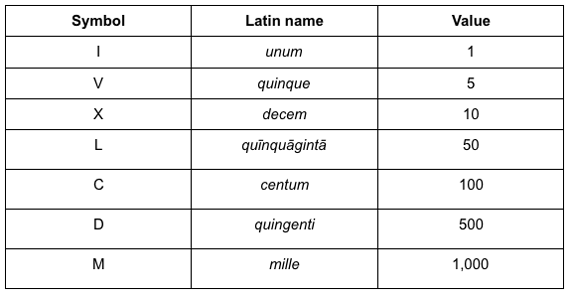

# Algorithms

## Who's idea was it to use letters for numbers anyway?

### Instructions
Given a number expressed in Roman numerals, convert that string into the number that string signifies.

For reference, see this table conatining the numerals and their corresponding values:

If the string you are given is not a proper Roman numeral sequence return "Wait, you're not a Roman".  

### Example
1. Given the string "MMMDCCLXXXII", your function should return 3782.

2. Given the string "CMXLIV", your function should return 944.

(For the simple version, your function can return 1166 for `2.`, which is the sum of all the numerals' corresponding values. This does not return the actual corresponding value of the given roman numeral, but it will suffice for the simple version of this algorithm. See the bonus to make the algorithm complete)

### Bonus
#### Special Rules

This exercise may prove pretty tricky. If you are having trouble, simply convert the numerals to their corresponding values.

For this algorithm to work properly though, we need to write logic that handles the "special rules" of Roman numerals.

Reference the second example above. Normally, Roman numerals are written in descending order. The larger values come first in the string, and then they are followed by smaller values. For nines and fours (acting as any digit) though, Roman numerals prepend a smaller value before a larger one, subtracting one.

An 8 is written as such: "VIII". It is a five followed by three ones, so five + one + one + one = eight. The same is true of a seven "VII", five + one + one = seven.

However, a nine would subtract from the following value. It is written as such: IX. This is akin to writing one-ten. We subtract the one from the ten after it. Similarly, a four would be written like so: IV. The one is subtracted from the five.