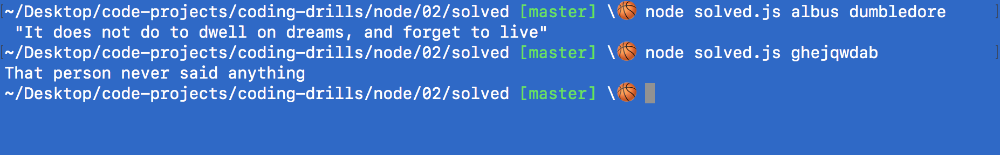

# Node

## Quote Finder

### Instructions

1. Run `node challenge-prompt.js` from the command line to check if your solution matches

Create a CLI (Command Line Interface) application that reads the name a user puts in and returns a quote that person said.

In this exercise, you are given an empty prompt.js (where you will do your work), and a quotes.txt.

The only names the user will be able to get quotes for are the ones included in quotes.txt.

If the user inputs a name not found in the file, return the message "That person never said anything".

### Example

### Hints
- You will need to use fs
- You will need to use process.argv