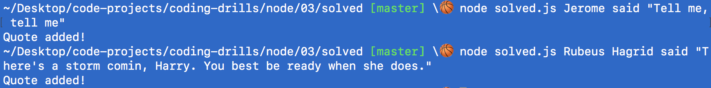
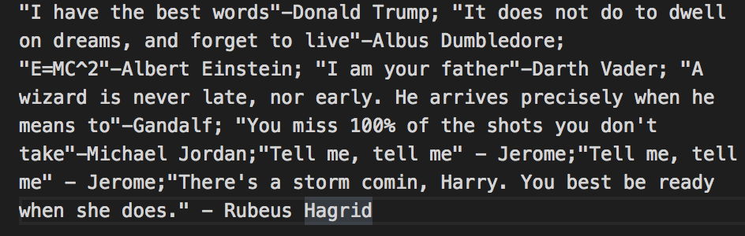

# Node

## Add Quotes

### Instructions

1. Run `node challenge-prompt.js` from the command line to check if your solution matches

Instead of giving our users a quote associated with the name they give us, we'll be opening up access so that they can add quotes of their own choosing.

The user should input the quote in the following format `<PERSON> said "<QUOTE>"` (see the example if this isn't clear).

Your job will be to reformat the command line arguments so that they are properly appended to the end of quote.txt

### Example

### Hints
- You will need to use fs
- You will need to use process.argv