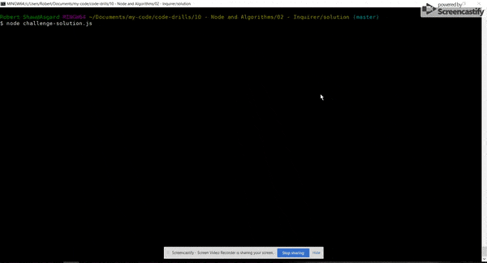

# Node

## Inquirer

### Instructions

_In this activity, we're going to be practicing more with the Inquirer package._

* Create an application that begins by prompting the user whether they want to add to a list of quotes, select a quote to display, or exit.

* If the user selects exit, the application ends.

* If the user selects display, they will see a list of quote authors to choose from. Once the user chooses an author, console log the corresponding quote and then send the user back to the main menu.

* If the user selects add, they will be prompted to enter the author and then the corresponding quote. Add the new quote to the list of available quotes and then send the user back to the main menu.

