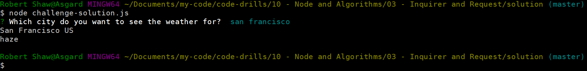

# Node

## Inquirer & Request

### Instructionsß

_In this activity we're going to be creating a very simple app that combines inquirer prompts and request in order to make user defined API calls-

* Create an app that asks the user for a city name that then returns the name of the city, what country it's in, and the description of the current weather for that city

