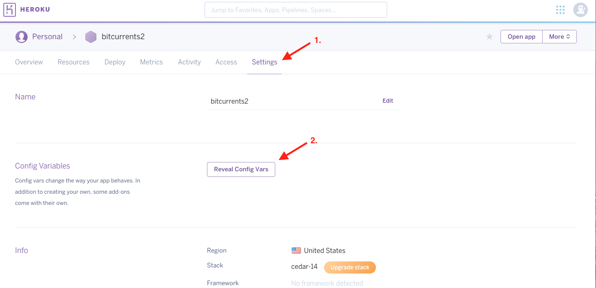

# Protecting API Keys in Node

* Often times when working with paid APIs, APIs with request limits, or APIs with access to personal account information, such as the Spotify API, we may want to avoid committing our API credentials to Github for the world to see.

* Luckily, there is a way to set these values locally without having share them publicly once we push our app up to Github. To accomplish this we'll use what are known as **environment variables**.

* When working on the front-end, we have access to a few global objects such as `window`, or `document`, or `console` which are always available. In Node, we have some other global objects, one of which is `process`. The `process` object is automatically available anywhere in Node and contains information about the currently running Node application.

  * Built into the `process` object is another nested object: `process.env`. We can use the `process.env` object to store and read our **environment variables** &mdash; e.g. values that are specific to the environment or computer where the Node process is running. We'll use these **environment variables** to store and read our sensitive information.

## Safely Setting Environment Variables

1. In order to safely set environment variables in a Node project, we must first install the [dotenv package](https://www.npmjs.com/package/dotenv) to our project as a dependency. 

   ```
   npm install dotenv
   ```

2. Next, at the entry point for our Node application (the file we run to start our Node app) add the following: 

   ```js
   // Read and set environment variables
   require("dotenv").config();
   ```

   * This code reads any environment variables we assign locally and sets them to the `process.env` object.

3. Next, we must create a new file named `.env` at the root of our project. We will use this file to assign our local environment variables. Consider the example `.env` file:

   ```
   # Spotify API keys

   SPOTIFY_ID=34e84d93de6a4650815e5420e0
   SPOTIFY_SECRET=5162cd8b5cf940f48702df
   ```

   * As long as we ran the code in step 2, we'd be able to access these values anywhere in our Node app using the `process.env` object. Example:

   ```js
   // prints `34e84d93de6a4650815e5420e0` to the console
   console.log(process.env.SPOTIFY_ID) 

   // prints `5162cd8b5cf940f48702df` to the console
   console.log(process.env.SPOTIFY_SECRET)
   // etc.
   ```

4. Finally, in order to prevent the environment variables we set in the `.env` file from being pushed up to Github, we must create a `.gitignore` file and add the `.env` file to the list of files to be ignored by git. Example:

   ```
   node_modules
   .DS_Store
   .env
   ```

   * If completed correctly, we should be able to access to any environment variables set in the `.env` file without having to expose them publicly!

## Setting Environment Variables on Heroku (Skip if working on the Liri assignment)

* If we followed all of the above steps and were to deploy our Node app to Heroku, the deployed application wouldn't have access to the environment variables we set in the `.env` file as it's being ignored by git. Fortunately, Heroku has a means for securely setting environment variables in our deployed apps.

1. Once your Heroku application has been created, log into your Heroku dashboard at <https://dashboard.heroku.com/apps> and select your app.

2. On the following screen, go to the "Settings" tab and click to "Reveal Config Vars".

   

3. Then add any environment variables being used and their values here.

   

   * If completed correctly, and the API keys set on Heroku correspond to those in the `.env` file, your application should work the same locally as it does when it's deployed.
