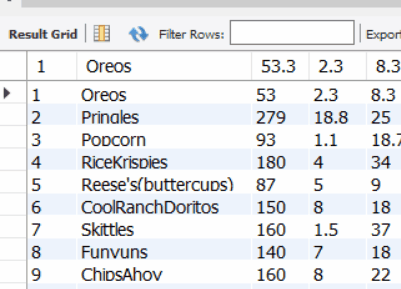

# MYSQL 

## Import Wizard and Schemas 

### MYSQL Fundamentals: Building schemas using csv files ###

- In this code drill, we are building a database of foods and their nutitional value nutrition.

1. Following the instructions in schema.sql, populate two tables:
- foods_nutrition
- foods_ingredients

2. Using the import wizard
    # For importing Ingredients
    - navigate to mysql workbench
    - right click the food_db and select import `table data import wizard`
    - click browse and select the ingredients.csv file and click next
    - use existing table and select food_db.ingredients then click next
    - then click next again (note: you might have to make the table data import window abit bigger to see the buttons)
    - click next one last time there should be a check mark next to prepare import and import data file 
    - now refresh the schema's and check out the ingredients table in food_db.

    # For importing Nutrition
    - navigate to mysql workbench
    - right click the food_db and select import `table data import wizard`
    - click browse and select the Nutrition.csv file and click next
    - use existing table and select food_db.Nutrition then click next
    - then click next again (note: you might have to make the table data import window abit bigger to see the buttons)
    - click next one last time there should be a check mark next to prepare import and import data file 
    - now refresh the schema's and check out the Nutrition table in food_db.

### Example

