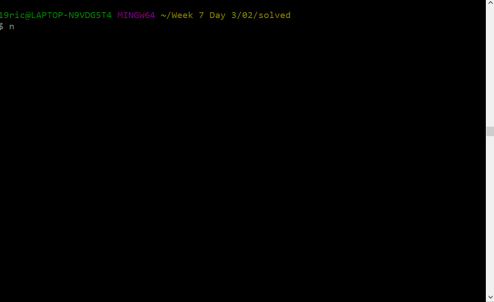

# MYSQL

## Inner Joins

### Instructions 
- do an `npm i` to install the mysql package or `npm install mysql`

- From activity one we use the import wizard and fill the food_db with data and now we can practice combining those tables.
- make sure you add in your own password to access the mysql database
- Create the query that selects the nutrition id and ingredients foodname 
- then haves ingredients inner joins nutrition on the food name of nutrition and ingredients 

- follow the steps of for query
    Step One - `SELECT` + Colum(s)name +
    Step Two- `FROM` + TableOne 
    Step Three - `INNER JOIN` + TableTwo
    Step Four - `ON` tableone.name  = tabletwo.name

- or go to the link below to check out how to do inner joins

### Example
- https://www.w3schools.com/sql/sql_join_inner.asp

