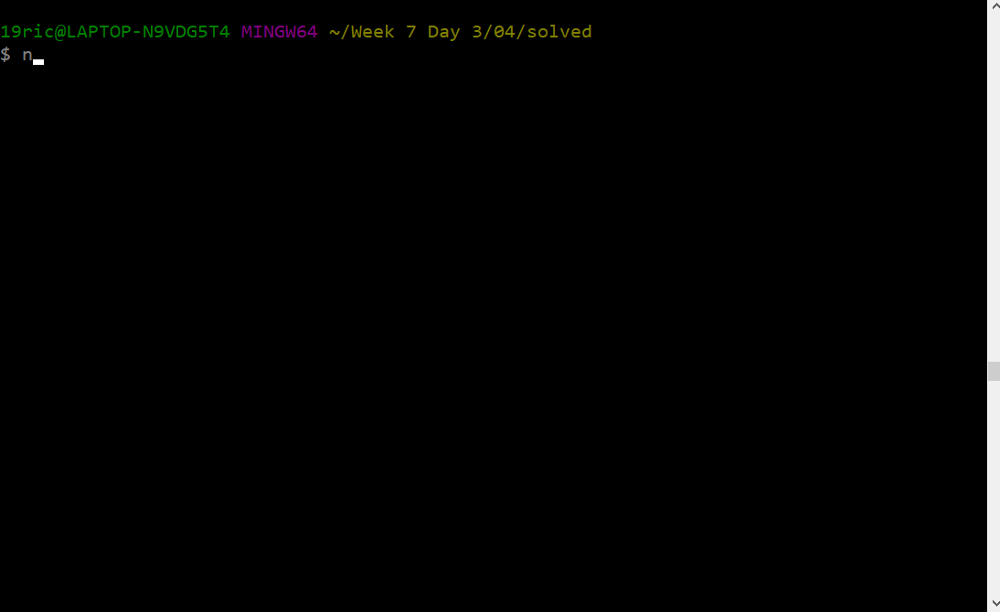

# MYSQL

## Right Joins

### Instructions 

- Run `npm i` to install from the command line to install MySQL (it is already listed as a dependency in your package.json)

- From activity one we use the import wizard and fill the food_db with data and now we can practice combining those tables.
- Make sure you add in your own password to access the mysql database
- Create the query that selects ingredients's food name and nutrition's protein, carbohyrates, fats and calories.
- Then have ingredients right join nutrition on nutrition(id) and ingredients(id)

- Follow the steps of for query
    Step One - `SELECT` + Colum(s)name +
    Step Two- `FROM` + TableOne 
    Step Three - `RIGHT JOIN` + TableTwo
    Step Four - `ON` tableone.name  = tabletwo.name

### Example

- A link to right join https://www.w3schools.com/sql/sql_join_right.asp

