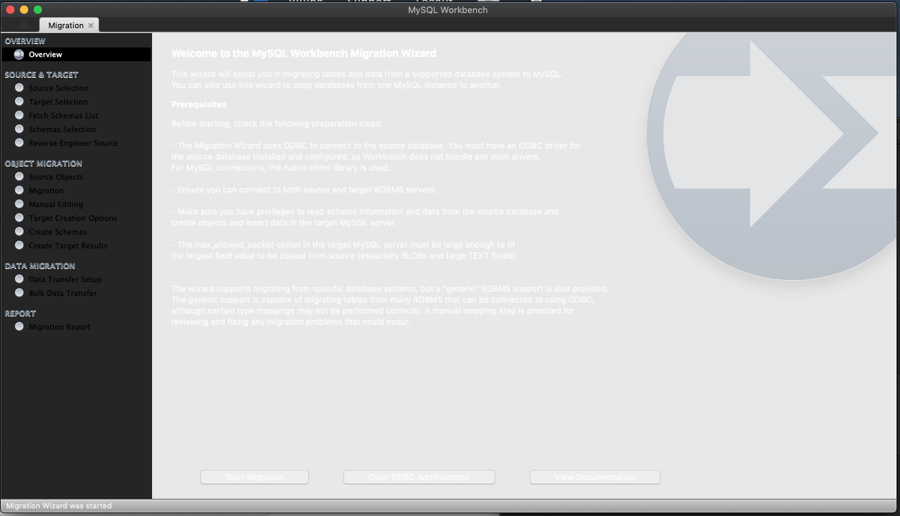
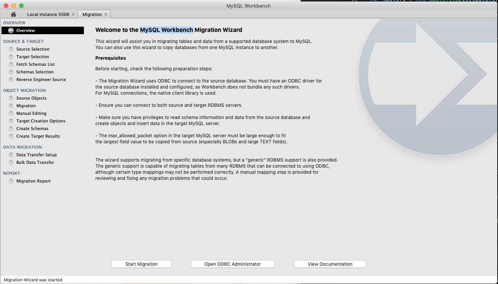

# MySQL Workbench Displays Incorrectly in Mojave

This is due to an error with Mojave's "Dark" appearance mode which is not compatible with MySQL Workbench GUI

***PREREQUISITES***

Mojave (macOS 10.14.x) with MySQL Work Bench (8.x).
Unable to view text in the User Interface due to graphical color inversion (pictured below).

***PICTURE***

**RESOLUTION**

1. Navigate to "Apple Logo > System Preferences > General"
2. Under "Appearance", change the appearance from "Dark" to "Light"
3. Exit "MySQL Workbench" (right click on it from the task bar and select "Quit")
4. Re-open "MySQL Workbench" from the Applications folder
5. Done

***RESOLVED***

