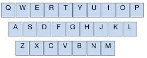

# Algorithms

## Keyboard Row

### Instructions

_In this activity we're going to be writing a function that when given an array of words returns a new array with only the words that can be typed using the letters on one row of a standard "QWERTY" keyboard._

* Assume that the words will be given to you in all lower case.

* There will be no symbols inside the words.

* Return only the words that can be individually typed on a single row of the keyboard.

* While each word has to be able to by typed on a single row, the words do not all have be typed on the same row. For example, "try" and "glad" are both valid words since they can individually be typed on a single row even though they use different rows of the keyboard.

