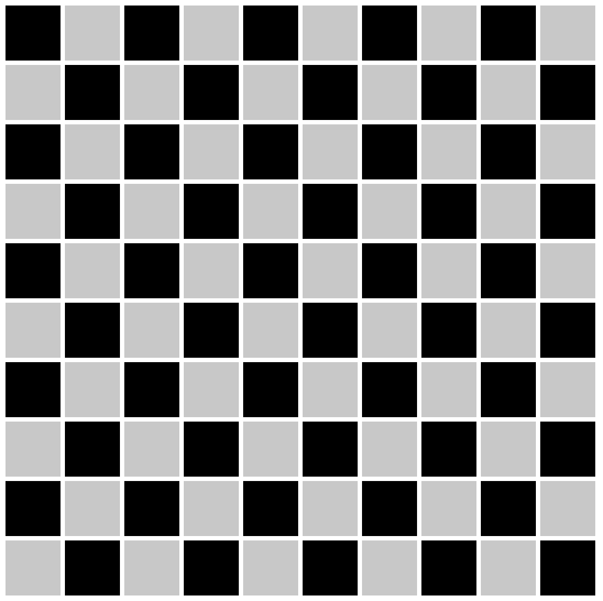

# Algorithms

## The King's Board

### Instructions
In Chess, the king piece can only move one square at a time, but he can move in any cardinal direction along with diagonals.

Imagine you're given a number, let's call it n. After n moves in how many possible squares can the king be.

Assume that the chessboard is infinitely large, so if we were given n=100, the king could possibly move 100 spaces in one direction and not reach the end of the board.

`In how many possible squares can the king find himself in after n moves? Write down a formula that gives this answer`

#### It is always helpful to visualize problems like this before you try to tackle them

You can also run the file in prompt.html to see the board on your browser, or add more pieces to the board if that helps you visualize the problem.

Create a markdown file and write your answer to this problem there. There is no coding for this problem. We are mainly interested in your thought process behind solving it.