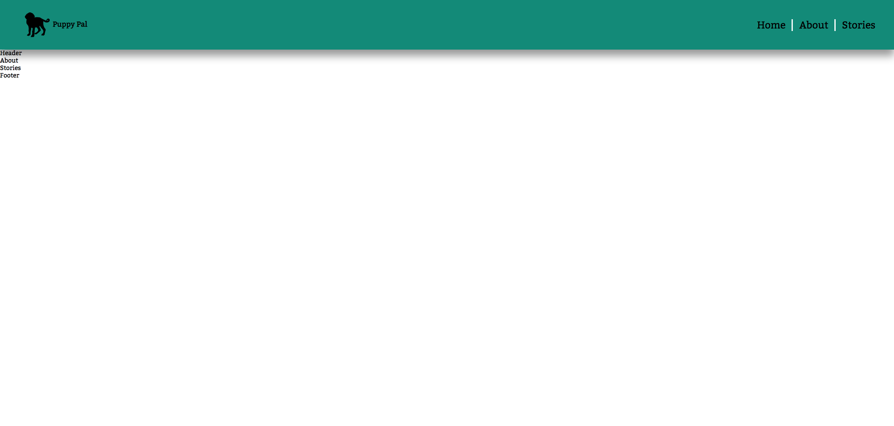

# Sass 

## BEM and Sass

In the last section, we were introduced to some of the features in Sass. In this section, we'll be diving into what really makes Sass unique. 

Sass allows us to nest our css within other css. This will make more sense as we demo some code. But first, we should talk about a class-naming convention that really allows us to take advantage of this nesting syntax. 

This class-naming convention is called BEM, which stands for Block-Element-Model. 

Let's consider an example:

```html
<section class="about">
  <h2 class="about__heading--large">About Me</h2>
  <h3 class="about__heading--small">How I got here</h3>

  <div class="about__card">
    <p class="about__description">lorem ipsum dolor sit amet consecteteur adipiscing.</p>
  </div>  

</section>

```

In the above example, about is the block. It is a significant section in our page's structure. In Sass, blocks are one of the key ways we separate and organize our styling. Notice how every other element has a class that contains the word `about`. That means they are all a part of the about block. 

Next we have the two underscores "`__`". These signifiy the elements. In this example, any element found within the about section should have a class that starts like this: `about__`. After the underscores, we specify the element. 

Finally, consider the headings. They're both essentially the same element, yet still different. That's where the modifier comes in. A modifier is signified by the `--`. In this example, we have one large heading, and one small. The -- helps us here. It is a `modifier` of the element. 

At this point, you might be thinking: "why would I write these obnoxiously long class names every time?". In the long run, these obnoxiously long class names actually end up saving us time, and allow us to stay extremely organized. 

Consider the syntax examples below:

This example is the plain css you're used to. Nothing special here. 

```css
.about {

}

.about__heading--large {

}

.about__heading--small {

}

.about__card {

}

.about__description {

}
```

This is the same code as above, but with sass.

```scss
.about {
  
  &__heading {

    &--large {

    }

    &--small {

    }
  }

  &__card {

  }

  &__description {

  }
}
```

You may have been able to intuitively figure out what's going on here. Again, in Sass, we nest class styling. The `&` operator simply refers to the class the child class is nested in. So `&__heading` translates to `.about__heading` given that it's nested in `.about {}`. As you can see with the modifiers, we can nest on multiple levels. 

## Instructions 
Now that you've been introduced to some of the key syntax in Sass, it's time to get coding!

1. Build out the scaffolding for your app. It contains a `nav`, a `header`, an about `section`, a stories `section`, and a `footer`. Within each element, write what it is. In other words, write the most basic HTML for each section. For example:

```html
<section class="about">
    About
</section>

```

2. Build out the HTML for the `nav` using the BEM convention. The nav contains a logo, and three tabs. (reference the image below if this is unclear).

3. Using Sass, and the syntax shown above, style the nav of your app. In the `components` folder, create the file `_nav.scss`. You will do your work in there. A navbar should be a reusable component. Therefpre, we'll store it in the components folder. At the end, all of your styling for the navbar should be contained within the styling of the nav block.

* Use a variable for the background color of the navbar. 

* Feel free to use the logo provided in this folder.

* Do not forget to import the _nav.scss file once you've created it.

Your finished project should look like the following:



4. 
- BONUS: Taking advantage of Sass's syntax, add a hover effect to the nav tabs. 
- BONUS: Research the :not psuedoclass and the :last-child pseudoclass. Use these tools to give ONLY the first two nav-tabs borders to their right.
