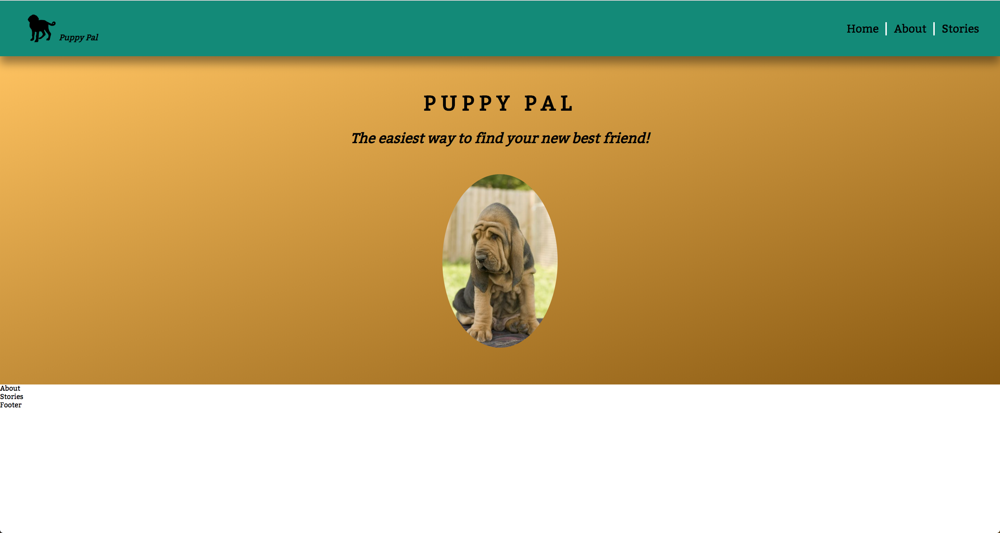

# Sass

## What goes in which file???

To this point, you may have noticed that Sass is not too different from CSS. That is indeed true. However, it does help with organization and structure. That is why we have such an elaborate class-naming convention and so many files to work in. 

In this section, we'll be working a little in almost every file so you can get a sense of how to use them when your styling with Sass on your own. 

In addition to understanding the purpose of each file in this setup we've created, we will also cover `mixins`. A mixin is an often used snippet of code that we store with what is essentially a variable. We can refer to several lines of code with one word this way. Mixins are a huge timesaver!

To declare a mixin:
```scss
@mixin center-element {
  position: absolute;
  left: 50%;
  top: 50%;
  transform: translate(-50%, -50%);
}

```

When we want to reference a mixin:
```scss

.element {
  @include center-element;
  height: 200px;
  width: 200px;
  background-color: red;
}

```


## Instructions

By the end of this section, your app should look like this:



We will be styling the header of our app in this section. 

1. As you style the header, you must use at least one `mixin`. You should define the mixin in `abstracts/_mixins.scss`.

2. Write out the HTML for the header section. The header section contains an h1, an h2, and an image. However, the headings are going to be a part of our overall `typography`. They will therefore NOT be a part of the `header block`. Instead, give each a class of `heading` with a unique modifier. You should style these in `_typography.scss`. It is good to keep consistency in your app's typography. If text has styling unique to one section, then it makes sense to make it a part of that block. 

3. Unlike the nav, the header is not a reusable component. However, it is a part of the overall layout. As such, create a file called `_header.scss` in the `layout` folder. `Write the styling for the header there`. Remember, unlike the headings, the image IS a part of the header block. 
* Look into the background-image: linear-gradient(). Use variables here.

4. You may notice that there is some margin between the two headings in the `header` section. It is perfectly OK to write this styling inside of `_header.scss`. However, we did our styling for the headings in typography. It would not make sense to add the margins there given that we want this styling to apply to all of our headers. Therefore, we will make a `utility class`. In `base/_utilities.scss`, create three classes:
- mb-sm
- mb-md
- mb-lg
The `mb` stands for margin bottom. The suffixes after the dash simply represent different sizes. Each of these classes will only contain the `margin-bottom` property. Each will have a different value. Apply whichever of these utility classes you find to be a fit to you larger heading. These utility classes are meant to be reused. If something just needs margin to the bottom, go ahead and add a utility class in your HTML.

5. You may notice that there are a few things we still haven't covered. Because of the scale of this project, we won't be able to implement all of the topics in this file structure we've created. However, we can still briefly discuss them here. 

##### Functions
Functions are a feature in Sass. They work in a somewhat similar way to functions in other programming languages. 
Consider the syntax below:

```scss
@function my-calculation-function($some-number, $another-number){
  @return $some-number + $another-number
}
```

If we are unsure what size we might want something to be, for example, functions can help us by taking in variables as arguments, and performing some set of work on them. 

Read more [here](http://thesassway.com/advanced/pure-sass-functions).

##### Animations
Animations work in Sass the same way they do in CSS. Animations can be a whole topic onto themselves, so there is too much content to simply gloss over here. The only thing to note is that when you write animations, they should be in the `base/_animations.scss` file. You may reference those animations elsewhere as you normally would. 


##### Pages
The pages folder is for exactly what it sounds like it is for, pages. The Puppy Pal app is a one page app. We therefore do not need to specify different styling for any separate pages. 

If we had a larger application with different pages, we could create separate files for each page, and write styling unique to that page in those files. 

