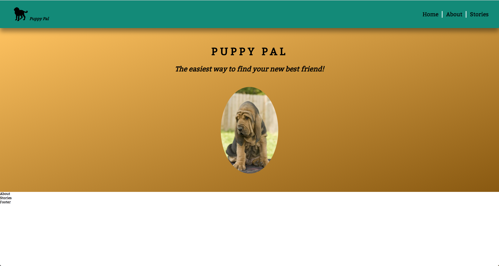
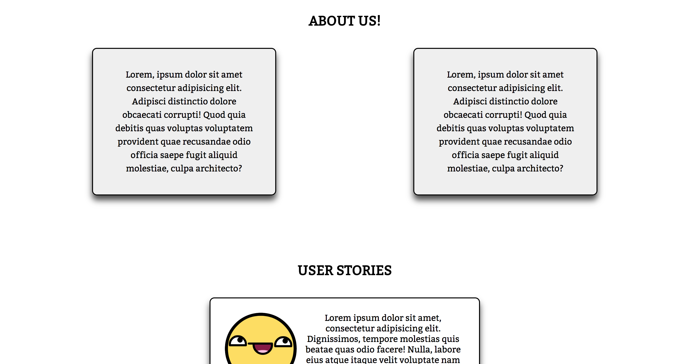
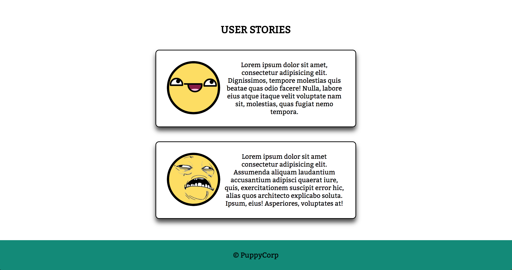

# Sass

## DIY Challenge

## Instructions
In the last four exercises, you should have picked up most of the key aspects and features in Sass. To reinforce those skils, you will be challenged to `finish styling this app on your own`. 

Feel free to be as creative as you'd like with this. You may put in as much or as little effort as you'd like. Just note that the next and final exercise will cover media queries in Sass. The more work you do in this section, the more you will be able to practice writing media queries with Sass. 

Again, feel free to style this app however you like. If you are not feeling like coming up with a design, please replicate the images below to the best of your abilities. 

 

 

- Take as much advantage of Sass as yu possibly can. 
- Remember to first write out your HTML.
- Remember to follow the BEM convention.
- Use utility classes, variables and mixins where appropriate.
- Consider whether a block is a reusable component (like a button or card) or a part of the overall layout (something that has unique styling). 
- Don't forget to import new files you create.