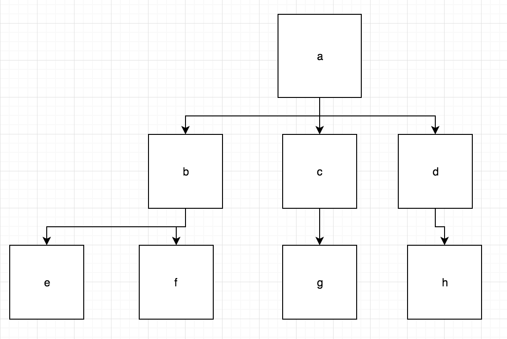

# Search Trees

## Building a Tree, Pt.2

### Instructions

By the end of this 3-part exercise, we'll build a tree capable of breadth-first and depth-first searches.

In part two, we'll be a breadth first search to our tree.

A breadth first search examines a tree row by row, starting from the top, or the root node.

#### Let's take this tree as an example:


In this example, `a`, at the top, is the root node. In breadth first and depth first searches, we start there.

The next row down has `b`, `c`, and `d`. Our search will go from left to right in this row. 

Then, we move on to the next, and in this case, the last, row. We would again go left to right, looking at `e`, `f`, `g`, and `h`, respectively. 

In sum the order of our search would be alphabetical in this case: [a,b,c,d,e,f,g,h]

`Add a breadth-first search function to your tree contructor`

- breadth: a function which conducts a breadth-first search on a given instance of the tree constructor. breadth should take a function as an argument. It should invoke this callback function with every given node, in the correct order, as an argument. In other words, if we invoked:
```
var arr = []
 tree.breadth(function(node) {
     arr.push(node.data);
 })
```
The single function call above should populate the array `arr` with the data of every single node in the tree, in a breadth-first order.

In prompt.js, you are given nothing aside from some tests. Feel free to paste your code from the previous exercises. In hint.js, you are given the skeleton of the constructor the same tests, and some hints.