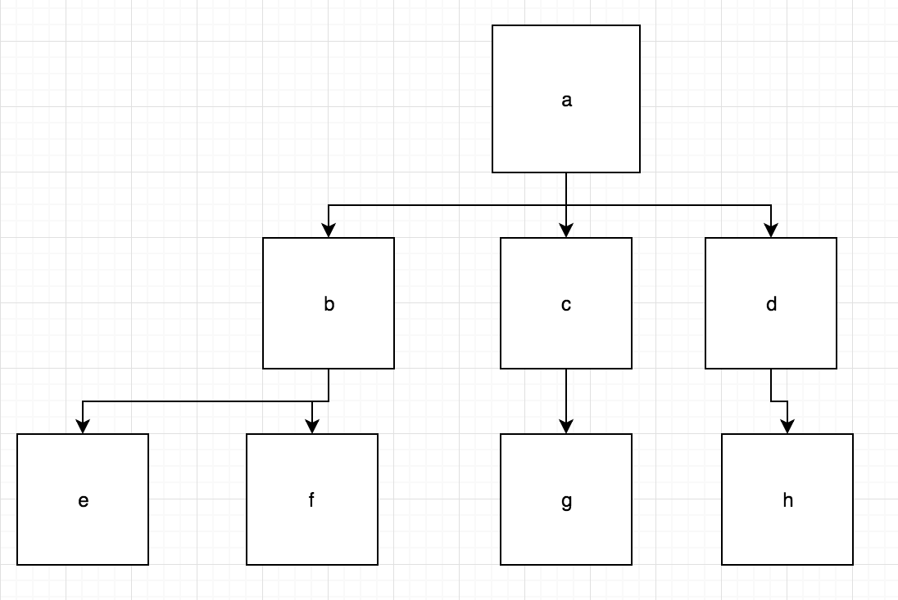

# Computer Science

## Search Trees - Branch width

### Instructions

Create a function that takes a node as an argument. 

#### Let's take this tree as an example:

If `a` were passed in to our function as an argument, we would also have access to all of its descendant nodes. 

Your function should return an array containing the "width" of each "row".

For the image given above, your function should return [1,3,4] if given `a`.

What you are essentially returning here is the amount of nodes in each "generation/branch/row" of our tree.

For example, `a` is alone on the first row. That's why the first value in the returned array would be 1. 

`b`, `c`, and `d` make up the second row. There are three nodes in the second row, which is why the second value in the returned array is 3. 

This same process continues for every row. 

In prompt.js, you are given a Node constructor, and some tests.

In hint/hint.js, you are given the same material that is given in prompt.js in addition to some pseudocode.