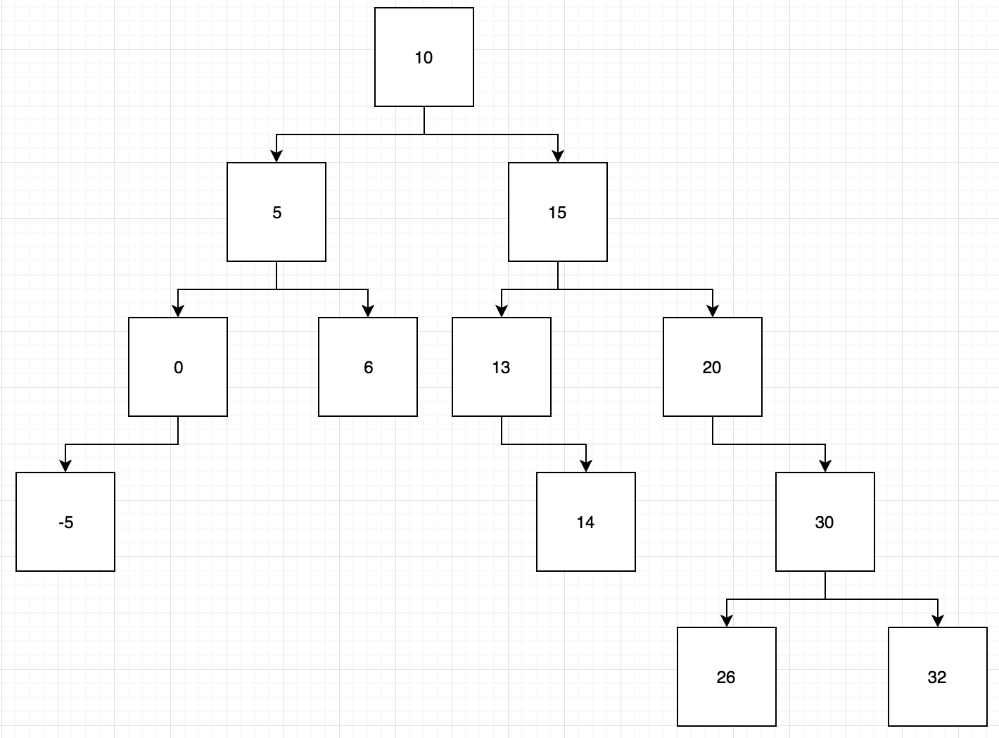
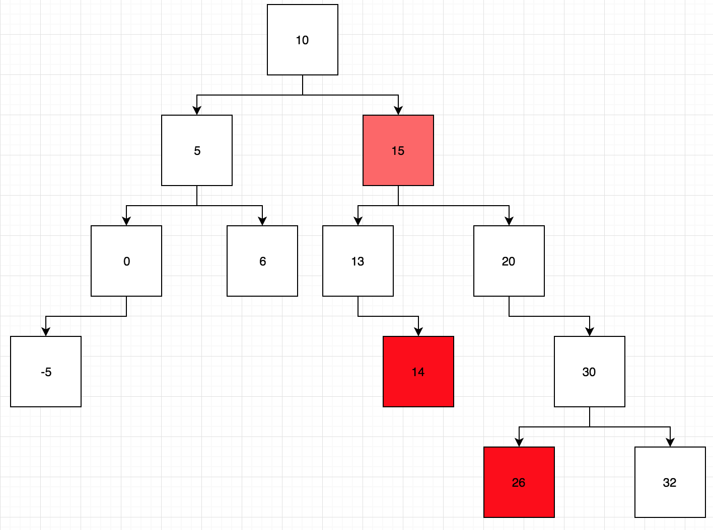
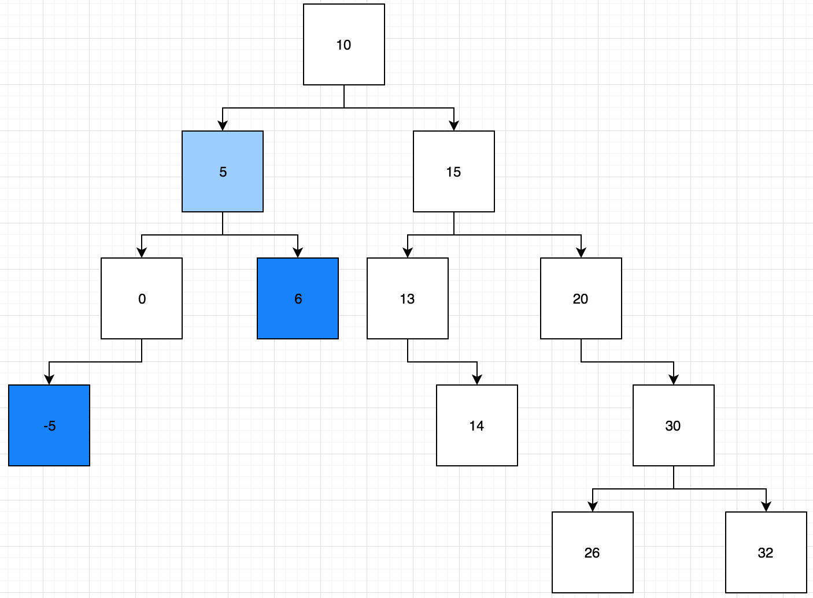

# Computer Science

## Binary Search - Lowest Common Ancestor

### Instructions

Consider the the following diagram of a Binary Search Tree(preview this file or open it elsewhere if you are reading this from a text editor):

       

`Your job is to find the LOWEST COMMON ANCESTOR of two nodes.`

You must complete a function which takes two separate nodes' values as arguments.

Think of the most recent ancestor in an evolutionary tree. That is essentially what we are looking for here. 

Consider the example below. It contains a solution assuming this particular tree's lca (lowest common ancestor) function was passed 14 and 26:

The lowest common ancestor is highlited in a lighter shade of red than 14 and 26.

Now consider this example. It assumes the same tree's lca function was passed -5 and 6:

The node with the value 5, in the lighter shade of blue, is the one we're looking for here. 

`Your job is to output the lowest common ancestor node`. To be clear, our function is passed two data values which nodes in our tree posses. We want to output the entire node that is the lowest common encestor. 

To solve this problem, it is very important to consider the structure and rules of a binary search tree.

In prompt, you are given some pre-built constructors with an empty lca function. You are also given some tests.

In hint, you are given all the above as well as some pseudocode.

`Look for "YOUR WORK HERE" to find where your code should be written.`