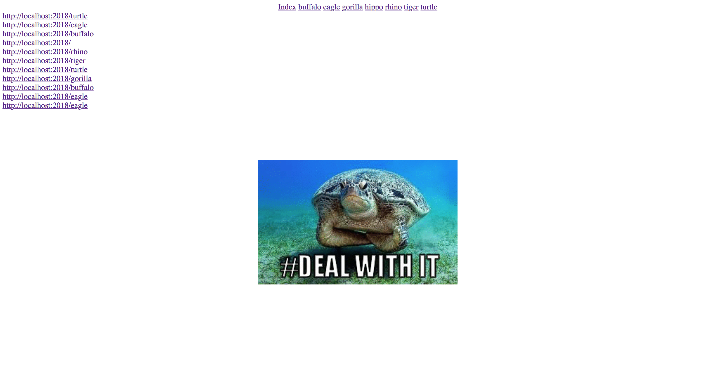

# Computer Science and Express

## Stacks - Mimicking Browser History Pt. 1

### Instructions

The goal of this exercise is to mimick a browser history page using a stack.

Browser histories already are stacks. When we move to a new page, the last page we visited is pushed to the top of a history stack.

Your job will be to create the following page:

You will not need to work on the front end for this exercise. 

In prompt/prompt.js you must do the following:
- Create a server using express
- Create a constructor for a stack with the following methods/data:
  - data: an array of all the the data in your stack
  - add: a function that adds to the stack
  - remove: a function that removes and return the data at the top of the stack
- Create an instance of your stack constructor called `backHistory`
- Create an API route at `/history` which `sends` backHistory's data
- Create 8 html routes that render each of the html documents given to you in the prompt folder. 
- You must use `req.protocol` and `req.originalUrl`.
- Remember, in order for our page to render all the pages we've visited, we'll need to add to our history stack every time we visit a page.

`Fill out prompt/prompt.js until it looks like the demo above. Each time you click on a link in the nav, it should take you to that link, and add it to the browser's history`
