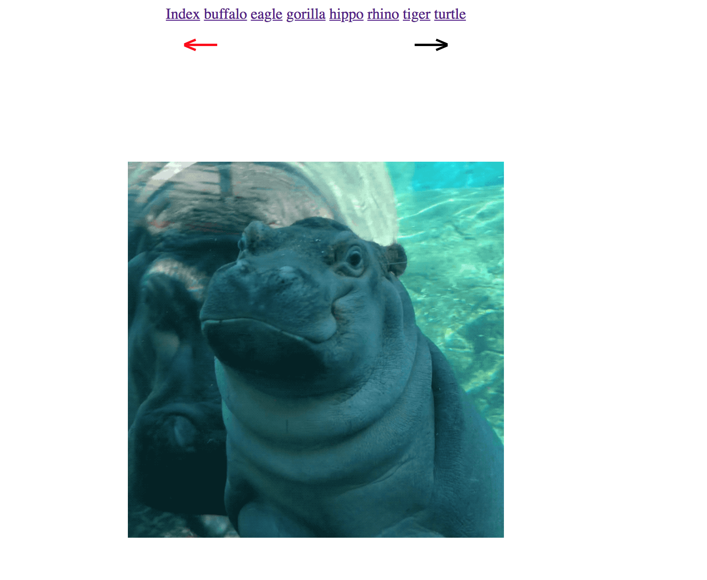

# Computer Science and Express

## Stacks - Mimicking Browser History Pt. 2

### Instructions

In this exercise, you will be mimicking the back and forwards buttons found in web browsers.

The final result should look like the following image:

Unlike the last exercise, you will not be rendering all the pages that have been visited.

You will also not need to work on the front end for this exercise. 

In prompt/prompt.js you must do the following:
- Create a server using express
- Create a constructor for a stack with the following methods/data:
  - data: an array of all the the data in your stack
  - add: a function that adds to the stack
  - remove: a function that removes and return the data at the top of the stack
  - peek: a function that returns the data at the top of the stack, but does not remove it.
- Create an instance of your stack constructor called `backHistory`, and another called `forwardHistory`.
- Create an API route at `/back`. 
- Create an API route at `/forward`.
- The above API routes should mimick the back and forward buttons in browsers.
  - If I have only visited one page, I shouldn't be able to go back. 
  - If I have not clicked back, I should not be able to go forward
- For example, if I visit index first, then visit /gorilla, then /tiger, when I hit the back button on /tiger, I should be on /gorilla. If I press forward from there, I should go to /tiger again.
- You will need to use both stacks for this exercise  
- Create 8 html routes that render each of the html documents given to you in the prompt folder. 

`Fill out prompt/prompt.js until it looks like the demo above. The back and forward buttons should work like those in a browser.`
