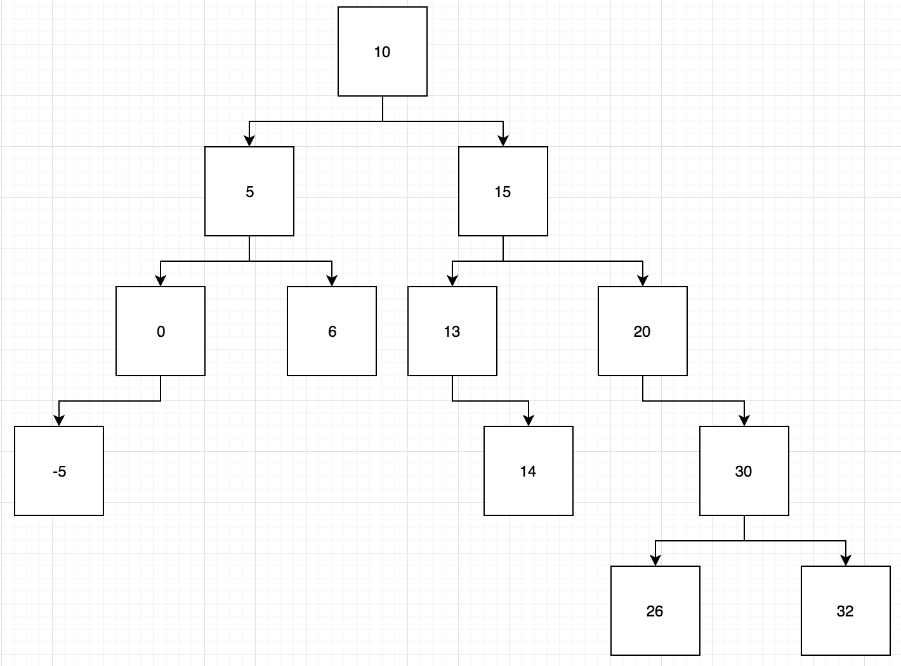

# Algorithms

## Binary Search Tree Duplicates

### Instructions

Consider the the following diagram of a Binary Search Tree(preview this file or open it elsewhere if you are reading this from a text editor):

       

`Your job is to write a function that determines whether or not a BST has more than one of the same value.`

If there are no duplicate values, return "valid".

If there are duplicate values, for example two fives in the same tree, return "invalid".

To solve this problem, it is very important to consider the structure and rules of a binary search tree.

In prompt, you are given some pre-built constructors with an empty lca function. You are also given some tests.

In hint, you are given all the above as well as some pseudocode.

`Look for "YOUR WORK HERE" to find where your code should be written.`