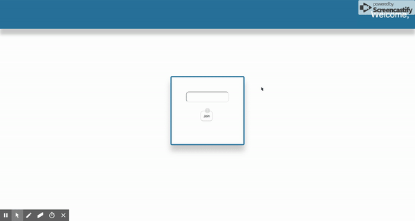

# React

## Conditional Rendering

### Instructions

* This is part 4 in a 4-part react exercise. If you have not completed the prior exercises, please refer to yesterday's code drills.

Conditional Rendering is a great way to update a react page or component.

When a user submits their name to our form, we will remove the form entirely, and instead render a greeting card.

The final product will look like this: 

In Landing.js, you have an empty state object, and a handleChange function. Your job is to replicate the above image. When a user submits the form, a card should render in place of that form.

### Hints

1. Add an onSubmit listener in your form tag. 
2. Within state, set a value (name of your choosing, `entered` if you aren't feeling creative), and set it to false.
3. When the form submits, setState to change the key you may in the last step to true.
4. Within the render function, set up a ternary that renders the card if the key in state you created is true, and the form if false.