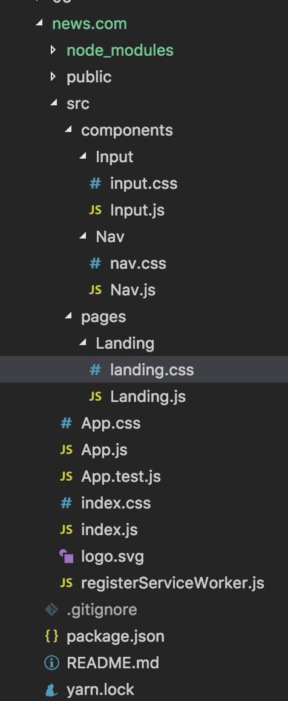

# React

## Page Setup

React is great for a lot of reasons. One of those reasons is how organized it can keep us through development. We have to think about how our page will be built before we get to building it. 

The organization process is extremely important with react.

This exercise is part 1 in a larger group of exercises. In step 1, we'll be setting our app up for success.

### Instructions
1. Navigate to the root of this directory from your command line. Once there, enter `create-react-app news.com`. Once the ensuing installation has finished, open the directory that command created within the root of this folder. Navigate to the `src` folder within that directory.
2. Within `src`, create two folders:
  - `components`
  - `pages`
3. Within pages, create the folder `Landing`. Within `Landing`, create the following files:
  - `Landing.js`
  - `landing.css`
4. Within `components`, create the following folders:
  - `Nav`
  - `Input`
5. Within `Nav` and `Input`, follow the same structure as `Landing`. In other words, each folder should contain its own name with the .js extension, and its own name in lowercase with the .css extension.

#### Your file structure should look like this:
