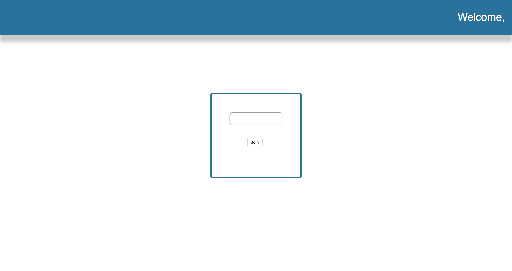

# React

## Page Components

Now that we've completed our initial setup, it's time to start building out the structure of our project. 

We'll be filling out three components in this exercise. Two will be "dumb" components, the other, a "smart" one. 

The most basic way to distinguish between "smart" and "dumb" components is to think of smart components as classes, and dumb components as const variables. 

In this exercise, we'll be building out reusable Nav and Input components, each of which will be featured in our landing page. 

`Important`: Regardless of whether a component is a class or not, we will always `import React from "react"`.

When working on the components below, don't forget to import/export them and to include your css from their corresponding files. 

### Instructions
1. In `Nav.js`, build out a Nav component:
  - It should take props. 
  - Style the Nav as you see fit, but it should always be at the top of a given page. 
  - Inside a p tag, it should take `name` as props. Make sure whatever is passed to this component as a `name` prop is found on the right hand side of our nav. Our app should say welcome, {props.name}.
2. In `Input.js`, build out a Input component: 
  - It should take props
  - Style the input as you see fit
  - Within your input tag, initialize type to props.type, name to props.name, onChange to props.change, and value to props.value. 
  * NOTE: the name in props here map to what they are representing, but they don't have to. Prop names are arbitrary--the design choices is yours. For example, onChange could have props.onChange or props.change. It doesn't matter either way as long as we properly refer to what we initialized the prop as when we created the component.
3. Once you built out these components, Import them into `Landing.js`:
  - Landing should be a class. 
  - Render your Nav component, within Landing. 
  - Render two Input components within Landing. One should have type text with no value, the other should have type submit with the value of "join".
4. Now to test it all... 
   - Delete everything, yes everything, WITHIN the render method in App.js. Replace it with the Landing component you just completed. 

#### Your final product should look like this. 
   