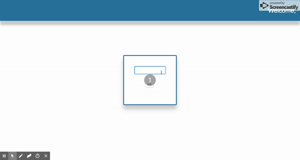

# React 

## Page Forms

* This is part 3 in a 4-part react exercise. If you have not completed the prior exercises, please refer to those code drills.

To this point, we've set ourselves up pretty nicely. We have a webpage to look at. However, we still have no functionality. 

In this exercise, we'll explore the benefits of how state and props can interact with one another in React. Whenever the state of a component is updated, React will use the powers of the Virtual DOM to rerender just that component, but not the entire page. 

In this exercise, we will update who our nav is greeting in real time as the user types content into the input. 

###  Instructions

1. In the last exercise, we rendered two Inputs. We gave one of them type="text". For that Input:
  - set name as "name"
  - set change to this.handleChange
2. For the Nav component:
  - set name to `this.state.name`
3. Create a function handleChange witch takes an argument e (for event). e.target will point to an object.
  - Destructure that object to grab a hold of the name and value
  - Set state so that the name points to the value. (Hint: use bracket notation)
4. Within Landing, set state to an empty object (this does NOT mean invoke the setState method)

#### If you've followed the above steps correctly, your app should do the following...
