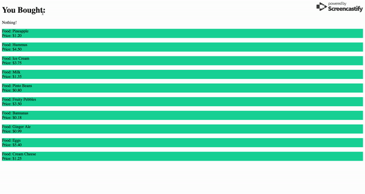

# React

## Passing arguments to functions in rendered elements

At this point, you are very familiar with the idea of passing arguments to functions. However, passing arguments to functions inside of markup might seem like a very strange idea. In React though, it's fairly common.

In this exercise, we'll be mapping though an array of "coupons", rendering each through a pre-built component. When we click on one of these coupons, the food the coupon refers to should be added to a list on the screen.

## Example 


### Instructions
1. Open propmt.html and examine the code
2. Inside of the showPurchases function (found in the `Page`   class), add food as the newest item in the array `food` found inside state. 
  * Do not mutate state directly. You need to use the setState method. Hint: Use array destructuring.
3. Inside of the p tag next to `<h1>You Bought:</h1>`, write a ternary which renders "Nothing!" if there is no content in the state.food array, and the actual contents of that same array if it does have any.
4. You'll notice that there is an array of objects called `foods`. You will also notice that there is a pre-built component called `Coupon`. `Coupon` takes in three different props. Map through foods below the ternary you just wrote, rendering a `Coupon` for each object in the `foods` array. Pass in the food and price as props to `Coupon`.
5. Consulting the syntax demo below, invoke the showPurchases function as a prop to `Coupon`. Pass in the food for each iteration of the map as an argument to that function.


* You will find numbers corresponding to steps in these instructions inside of prompt.html

## Syntax Demo
```javascript


doThing(argument) {
  console.log(argument)
}

render() {
  return (
    <div>
    <button onClick={() => this.doThing("chicken")}>Log</button>
    </div>
  )
}

```