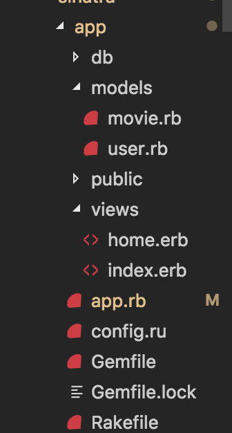

# Sinatra

## Fav-flix: A full-stack app built with Sinatra

### Introduction

Sinatra is a Ruby framework designed to easily create web applications. 

In terms of functionality, think of it as similar to Node with Express.

Check out some [applications build with Sinatra](http://sinatrarb.com/wild.html).

To learn the basics of Sinatra, we'll build a fairly simple application. In a nutshell, our application will allow a user to pick a username, search for movies, and then save his/her favorite movies (which will be associated specifically with that username).

This means we will cover:
- Configuring a Sinatra application
- Routing
- Connecting to a client
- ORM
- Database migration
- Data model associations

### Prerequisites
- MySQL
- Ruby 

### Instructions

1. Run `Gem install bundle` (it does not matter where this command is run. This is a package manager like npm or yarn).

2. Create a new app. You can call it whatever you want, but if you're not feeling creative, call it favflix.

3. Run `bundle init`. This will create a `Gemfile` for you. Think of this as our package.json. It is where we will list our app's dependencies.


4. These are our app's dependencies:
```ruby

# DEPENDENCIES
# Lets us hit external API
gem 'rest-client'
# The backbone. With Sinatra, we can easily set up our routes. Think of it as express for Ruby
gem "sinatra"
# DB
gem "mysql2"
# ORM
gem 'sinatra-activerecord'
# Task-automater
gem 'rake'
# Get/set cookies
gem "sinatra-contrib"
# Sends responses as JSON
gem "json"

```
Copy the above code and paste it inside you gemfile. If you are curious about what you are adding to your app, please refer to the comments above each dependency.

5. From the root of your app, run `bundle install`. This will read our `Gemfile` and install all the dependencies we've listed within it. You shoulde see `Gemfile.lock` in your app's root once this command has run. 

6. At your app's root, create the files `app.rb` and `config.ru`

7. In `config.ru`, write the following code. 

```ruby
require "./app"

run HiSinatra

```

This code will allow us to start our app from the HiSinatra class we will define soon.

8. Let's require all the packages we've installed for future use. In `app.rb`, write the following code: 
```ruby
# DEPENDENCIES
# Lets us hit external API
require 'rest-client'
require "sinatra/base"
require "sinatra/cookies"
require "json"
require "mysql2"
require 'sinatra/activerecord'
```

9. Let's instantiate the classs that will contain all of our routes.

```ruby
class HiSinatra < Sinatra::Base

end

```

What we're doing here is making a new class called HiSinatra (it does not need to be called that), and building it on top of Sinatra's Base class. Put more simply though, we're creating a class where we'll define our routes. 

Inside of the class we just created, we can define routes like so:

```ruby

get "/" do
    "Hello World"
end

```

If you write the above code within the class we defined in this step, and then run `rackup` from the command line, you should see a page with "hello world" written on it at localhost:9292. 

If you are able to see "hello world" on your browser at localhost:9292, you've done everything correctly up to this point.

10. Now let's build out our file structure:



Replicate the above file structure. This includes the following:

- Create a file `Rakefile`
- Create a folder `db`
- Create a folder `models`
    - Within models, create `movie.rb`
    - Within models, create `user.rb`
- Create a folder `views`
    - Within views, create `index.erb`
    - Within views, create `home.erb`
- The public folder is already provided for you. 

11. Now that our app's basic structure has been filled out. We can start to talk about rendering some views. This is extremely simple in Sinatra. First though, let's create some content to render.

In the last step, we created a file called `index.erb`. Fill it out with the following code: 

```html

<!DOCTYPE html>
<html>
<head>
    <title>FavFlix</title>
    <link rel="stylesheet" href="https://stackpath.bootstrapcdn.com/bootstrap/4.2.1/css/bootstrap.min.css" integrity="sha384-GJzZqFGwb1QTTN6wy59ffF1BuGJpLSa9DkKMp0DgiMDm4iYMj70gZWKYbI706tWS" crossorigin="anonymous">
    <link rel="stylesheet" type="text/css" href="/assets/css/style.css">
</head>
<body>
    <div class="index__parallax"></div>

    <div class="container">
        <div class="jumbotron mt-lg">
            <h1 class="display-4">HELLO!</h1>
            <p class="lead">Please enter your username if you've already made an account with us.</p>
            <p class="lead">If you haven't made a username yet, go ahead and enter one below to get started.</p>
            <hr class="my-4">
            <form id="signUpForm">
                <input id="username" type="text" name="username">
                <input id="signUpButton" type="submit" value="submit">
            </form>
        </div>
    </div>
    

    <!-- CDNs-->
    <script src="https://code.jquery.com/jquery-3.3.1.slim.min.js" integrity="sha384-q8i/X+965DzO0rT7abK41JStQIAqVgRVzpbzo5smXKp4YfRvH+8abtTE1Pi6jizo" crossorigin="anonymous"></script>
    <script src="https://cdnjs.cloudflare.com/ajax/libs/popper.js/1.14.6/umd/popper.min.js" integrity="sha384-wHAiFfRlMFy6i5SRaxvfOCifBUQy1xHdJ/yoi7FRNXMRBu5WHdZYu1hA6ZOblgut" crossorigin="anonymous"></script>
    <script src="https://stackpath.bootstrapcdn.com/bootstrap/4.2.1/js/bootstrap.min.js" integrity="sha384-B0UglyR+jN6CkvvICOB2joaf5I4l3gm9GU6Hc1og6Ls7i6U/mkkaduKaBhlAXv9k" crossorigin="anonymous"></script>
    <script src="https://cdnjs.cloudflare.com/ajax/libs/jquery/3.2.1/jquery.min.js"></script>
    <script src="assets/javascript/index.js"></script>
</body>
</html>

```

If you look at the code above, you may notice that both the link tag refering to our local stylesheet, and the script tag refering to our local javascript file. Do not have the proper relative path from this erb file. That is because sinatra is serving up our public folder as static assets. What this means for us is that we can refer to things inside the `public` folder (it _must_ be called `public`, sinatra is looking specifically for a folder with this name), we can act as though we are already inside the public folder. Therefore, our relative path begins at `assets`.

12. Once you've pasted the above code, go back to `app.rb`. The last time we were in this file, we wrote "hello world" to the root route of our app. Now, we'll actually serve up a view.

The code looks like this:

```ruby

 get "/" do
        # We can simply refer to our HTML (stored in this app as .erb files) with the following syntax.
        erb :index
    end     

```

Run `rackup` again from your project's root. Open localhost:9292 in your browesr. If you see a background image and a form, you're all set to this point. 

13. Now that we've learned how to render a basic view, let's talk about our database. First off, configure your code to connect with your MySQL database.
Write the code below in `app.rb` towards the top of the file. 

* Create a database in MySQL workbench which you will refer to in the code below.

```ruby
ActiveRecord::Base.establish_connection adapter: 'mysql2', database: 'sinatra_db', host: 'localhost', username: 'root', password: 'password' 

```

Change out the above code so that it matches with your own device's settings. 

Active record is an ORM (Object Relational Model) that we can use with Sinatra. With the above code, we are configuring it to communciate with our MySQL server. In other words, all database queries we make will be made with MySQL. 

14. Navigate to the `Rakefile` we created in step 10. Inside that file, write the following code:
```ruby
require 'sinatra/activerecord/rake'
require './app'

```

15. In this step, we'll be configuring `ActiveRecord`, our ORM, with our app. If you want to take on a challenge and figure it out on your own, follow [this excellent guide](https://gist.github.com/jtallant/fd66db19e078809dfe94401a0fc814d2). Otherwise, read on! 

In this The `Rakefile` we wrote to in the last step will help use with our database migrations. In Node, we may have had .sql files inside of a folder called db. We would then paste the schema into MySQL workbench, for example. Sinatra can handle this work for us. 

In this app, we will be using two models:
 - User
 - Movie

Let's define our SQL tables. We're going to run three commands from the command line.
- rake db:create_migration NAME=create_users_table
- rake db:create_migration NAME=create_movies_table
- rake db:create_migration NAME=create_movies_users_table

Once you've run these three commands, open the `db` folder we created in step 10. You should notice a new folder called `migrate`. Open `migrate`. Inside should be three files, each beginning with a random sequence of numbers. It is inside of these files that we will define our tables.

* Note: Before, we mentioned that we would be using two models. However, we ran three commands above, creating three migration files. The reason for this is that we need to create a join table for our users and movies. A user has many movies, and a movie can belong to many users. This third join table will help us with our queries. 

16. Even though the last step created three new files for us, you'll notice that there isn't too much content inside of those files. Let's go ahead and populate those schema now. 
a. First off, we'll create our user schema. We will not tackle proper authentication in this tutorial, so the only custom column we'll ask for is `username`. In addition, we'll ask for `created_at` and `updated_at` columns, which will automatically be filled out by ActiveRecord. Inside of the `create user` migration file, write the following code (place this inside of the class that was generated along with the file):
```ruby

  def change
    create_table :users do | t |
      t.string :username
      t.datetime :created_at
      t.datetime :updated_at 
    end
  end

``` 
b. Next, we'll create our movie table. Here, we'll want columns for movie_name, movie_poster, and movie_year. 
```ruby
  def change
    create_table :movies do | t | 
      t.string :movie_name
      t.string :movie_poster
      t.string :movie_year 
      t.datetime :created_at
      t.datetime :updated_at 
    end
  end
```
c. Finally, we'll create the schema for our join table, where we'll keep track of the movie's id, and the user's id.

```ruby

  def change 
    create_table :movies_users do | t | 
      t.integer :user_id
      t.integer :movie_id
    end
  end
```

17. Now that we've defined our schema, we are ready to migrate them. Run `rake db:migrate`. To make sure it worked, go to your MySQL workbench, and see if those tables have been created under our database.

18. In this step, we will configure our data models. Our models will allow us to write to and read from the tables we just defined. In a model, you can define custom methods and create associations. 

The type of associations we will use here are a `has_and_belongs_to_many`. We will also want to validate the username column so that it is both required, (presence) and so that it can't be duplicated (uniqueness). Have a look below to see how it works. 

```ruby
class User < ActiveRecord::Base
    has_and_belongs_to_many :movies
    validates :username, :presence => true, :uniqueness => true
end

```

The movie model will be very similar, except even more simple given that we don't need any validations on it. 

```ruby
class Movie < ActiveRecord::Base
    has_and_belongs_to_many :users
end
```

19. Now suppose we want to seed our database. One option would be to navigate to our MySQL workbench, and write raw SQL statements. That would work just fine, but ActiveRecord can seed our db for us. 

Inside the `db` folder, create a file called `seeds.rb`. Inside of our seeds file, we can populate our db with the following syntax:

```ruby

# USER SEEDS
users = [
  {username: "Hermione_Granger"},
  {username: "Jon_Snow"}
]

users.each do |u|
  User.create(u)
end
```

Notice that we've created an array of objects, where the keys in those objects map exactly to the column(s) we defined in our schema. Feel free to seed the movies table for some extra practice!

To actually implement the seeds, run `rake db:seed`. Check you MySQL workbench again to see if the seeding was successful.

20. The last thing we're going to do before we begin to give are app functiality is just a little bit of house-keeping. At the top of your HiSinatra class, add the following code:

```ruby
    # Lets us read and write cookies
    helpers Sinatra::Cookies
    
    # Let's us see errors
    configure :production, :development do
        enable :logging
    end
  
```

21. OK, we've done a bunch of set up to this point, but haven't really been able to see the product of our work much. Now, we can finally start to bring the whole thing together.  

The first functionality we'll handle is "authentication" (put in quotes because we'll be implementing just about as little of an authentication apparatus as possible).

In our case, we'll be handling both through one form (and one input too)
. In public you'll find that the form already has a `submit listener` for that form which makes an AJAX POST request to `/api/signin/:username`.

To this point, we've only set up one route: "/". As we saw from the keyword `get` preceding it, that route was made for `get requests` sent to the root route. 

So how do we make POST requests? Simple, we use the word post instead. Have a look:

```ruby

    post "/api/signin/:username" do

    end

```

Implement the above into your own HiSinatra class. 

Before we proceed, let's talk about what we just did. Remember, on our index page, we have one single form with one single input. We will use this one route to handle anything submited from that form. That means that this route will contain separate conditions for both a signup and signin. 

We will do this by grabbing a hold of the username submitted in the input, and checking it against our users table. If the name exists, sign the user in. If it doesn't sign them up. The practical difference here will be using ActiveRecord's `create method` or its `where` method. Furthermore, we will set cookies with the user's username to immitate authenticated sessions.

Notice how, in our route, we have the following: `/:username`. If you've worked with express, you'll recognize this as a parameter--an arbitrary word that can take act as any other. So if we print `params[:username]` inside this route, we will see whatever the given username is. This is how we will inform our server of the username that has been submitted. 

Ok, now for some code. Write the following inside of the signing route:

```ruby
    post "/api/signin/:username" do
        # Check to see if username exists. If it does, log them in. If not, sign them up.
        check_user = User.where({"username": params[:username]})
        # Check to see if the user exists in the database
        if check_user[0]
            # Send the user back as a response
            check_user[0]
            # Store the existing user's id as a cookie
            cookies[:userid] = check_user[0].id         
            puts cookies
        # If no one is found with the given username
        else   
            puts params[:username]
            # Create new user
            new_user = User.create({username: params[:username]})
            # Send the new user's data as json to client
            new_user
            # Set the new user's id as a cookie
            cookies[:userid] = new_user.id
            puts cookies
        end
    end

```

Above, we are using the check_user variable as a way of seeing whether or not the username given through our route's parameters exists. We are using the User model we defined earlier to make our queries possible.

The first condition (if) handles the "sign in" logic. If the check_user array is populated at all (it will only ever have one value object if it is given that we set unique validations in our data model).

The second condition (else) handles the logic of an unrecognized username. 

Notice that in both cases, we create cookies equal to the username provided to us. We will read these cookies later to identify which user is logged in when they are on the home page, our other view. 

Finally, let's examine the simplicity of the Ruby code. In javascript, we would need to set up a promise to determine what happens once the query to our database is finally complete. In Ruby, we can simply set a variable equal to our query. When we use that variable a couple lines later, it has already waited for the query to be finished. No promises needed--pretty cool!

22. In our client-side code (already provided), we have logic that brings the user to a new page once they've submitted the sign-in/up form. We have some work to do in order to make that possible. First, let's populate `views/home.erb`. Use the following code:

```html
<!DOCTYPE html>
<html lang="en">
<head>
    <meta charset="UTF-8">
    <meta name="viewport" content="width=device-width, initial-scale=1.0">
    <meta http-equiv="X-UA-Compatible" content="ie=edge">
    <link rel="stylesheet" href="https://stackpath.bootstrapcdn.com/bootstrap/4.2.1/css/bootstrap.min.css" integrity="sha384-GJzZqFGwb1QTTN6wy59ffF1BuGJpLSa9DkKMp0DgiMDm4iYMj70gZWKYbI706tWS" crossorigin="anonymous">
    <link rel="stylesheet" type="text/css" href="/assets/css/style.css">
    <title>FavFlix</title>
</head>
<body>
    <div class="home__parallax"></div>
    <div class="container">

    <div class="jumbotron">
        <div class="row">
        <div class="col-6">
            <h1>Welcome, <span class="username"></span>! </h1>
            <h2>Search for movies here.</h2>

            <form id="movieSearch">
                <input type="text" id="movie">
                <input type="submit" value="submit">
            </form>
        </div>
        <div class="col-6">
            <div id="searchedMovie"></div>
        </div>
        </div>
    </div>
       
        <h2 class="your-movies">Your movies</h2>
        

        <div id="savedMovies" class="row">
            <% @movies.each do |movie| %>
                <div class="col-4">
                    <div class="card" style="width: 18rem;">
                    .movie_poster}" class="card-img-top" alt="...">
                        <div class="card-body">
                            <h5 class="card-title"><%= movie.movie_name%></h5>
                            <p class="card-text"><%= movie.movie_year %></p>
                        </div>
                    </div>
                </div>
            <% end %>
        </div>
    </div>
    <!-- CDNs-->
    <script src="https://code.jquery.com/jquery-3.3.1.slim.min.js" integrity="sha384-q8i/X+965DzO0rT7abK41JStQIAqVgRVzpbzo5smXKp4YfRvH+8abtTE1Pi6jizo" crossorigin="anonymous"></script>
    <script src="https://cdnjs.cloudflare.com/ajax/libs/popper.js/1.14.6/umd/popper.min.js" integrity="sha384-wHAiFfRlMFy6i5SRaxvfOCifBUQy1xHdJ/yoi7FRNXMRBu5WHdZYu1hA6ZOblgut" crossorigin="anonymous"></script>
    <script src="https://stackpath.bootstrapcdn.com/bootstrap/4.2.1/js/bootstrap.min.js" integrity="sha384-B0UglyR+jN6CkvvICOB2joaf5I4l3gm9GU6Hc1og6Ls7i6U/mkkaduKaBhlAXv9k" crossorigin="anonymous"></script>
    <script src="https://cdnjs.cloudflare.com/ajax/libs/jquery/3.2.1/jquery.min.js"></script>
    <script src="/assets/javascript/home.js"></script>
</body>
</html>

```

Let's have a look inside the div with the id of `savedMovies`. We'll notice that there's some code that does not look like HTML in there. Remember, this is a .erb file, not a .html file. We can take advantage of this by using Sinatra's built in templating language. If you've used `Handlebars` (another templating language), you'll notice that it's quite similar. Keep this syntax in mind. We'll revisit this in the next step.

23. We're going to create our second and final get route that renders a view in this step. However, this one won't be as simple as the last one we made. 

In the last step, we made note of the new syntax we observed in `home.erb`. What that code is doing is looping through n amount of movies and rendering them all to the page. We are looping through `@movies`, but that doesn't mean anything until we explicitly give it meaning, just like in Handlebars. 

We will do this work inside of the `/home` route. Observe the code below and then add it to your own app. 

```ruby
    # Render the home page
    get "/home" do
        # Identify the logged in user
        logged_in_user = User.find(cookies[:userid])
        # Initialize the word movies to point to all the movies associated to the logged in user so we have a keyword to use in our .erb files. 
        @movies = logged_in_user.movies
        # Send the home page
        erb :home
    end

```

We are doing three things in the route above:
- Using cookies, we grab a hold of the user's username, then query our database with it to grab a hold of the logged-in user.
- We create an arbitrarily named variable (though we must use the `@` symbol) called movies. Movies is set to all of the movies associated with our logged in users.
- We render the home page. 

24. OK, now we just need to create one more route, and then we'll be ready to test out our home page. We're going to set up an API route that looks through the broweser's cookies (just like we did in `/home`). This route is hit in our client-side javascript when we visit `/home`.

```ruby

    #  Get a user's info (in this case, just their username).
    get "/api/user" do
        # Informs the server that we'd like to return json
        content_type :json
        # Send back the cookies as json
        # cookies.to_json
        logged_in_user = User.find(cookies[:userid])
        if (logged_in_user)
            # Send a JSON response with the user's info.
            logged_in_user.to_json
        else 
            # Send this json back if the user is not logged in
            {"error": "Please sign in first"}  
        end 
    end   

```

25. Great, now we can test how well the last few steps went. Run `rackup`, create a username, and submit the form. If you are greeted by your username on the next page, you're all set to this point. If not, please review the prior steps to see what might be holding you up. 

26. In step 23, we sent along some data with our `home` view. When testing the home view in the last step we probably didn't see any movies listed. Of course, that is what we would expect given that we didn't save any movies under the username you chose. To make that possible though, we have three final API routes we need to set up.
- A route that searches OMDB's database based on the user's search
- A route that saves that movie to our own database
- A route that retrieves all movies associated with a given user. 

Of course, the first of these we want to tackle is the movie search. Without that, there are no movies to save.

Remember earlier, we installed a dependency called Rest Client. We will use this package to communicate with external APIs. In this case, we want to use OMDB's API.

We will set up a GET route `/api/movies/:movie` for this query. Again, the client-side javascript to help us make this query is already set up. 

Write out the route below in your HiSinatra class:


```ruby
    # Query OMDBs API for a single movie. Return the results to the client as JSON.
    get "/api/movies/:movie" do 
        # Informs the server that we'd like to return json
        content_type :json
        # Query the omdb API with whatever movie the user searched for. 
        data = RestClient.get("https://www.omdbapi.com/?t=#{params[:movie]}&y=&plot=short&apikey=trilogy")
        puts data
        # Send the results of our query to the client
        data
    end    

```

Notice how simple this request is. We simply declare that we would like to send JSON to whoever hits this route. We make our query using the movie passed as a parameter. Then we finally send the result of that query to the client. 

To test this. Run your app and try to search a movie. If you see the movie poster pop up in your browser, you're all set up to this point. 


27. OK, now for the saving functionality. We need to be able to make sure that the movie we save is associated with the user.

Write out the following route. 

```ruby

    # Save a particular movie
    post "/api/movies/save" do 
        # Identify the logged in user
        logged_in_user = User.find(cookies[:userid])
        # Create a new movie in our db associated to the logged in user
        logged_in_user.movies << Movie.create({
            movie_name: params[:name],
            movie_poster: params[:poster],
            movie_year: params[:year]
        })
        # For our own purposes only, just so we can see the movies coming back from our db. 
        logged_in_user.movies.each do | movie |
            puts movie.id
        end
        puts "Movie saved"
    end

```
Similar to the work we've already done in this app, we first need to identify the logged-in user. 

Next, we create a new movie explicitly associated to that user. This is made possible because of the relationships we defined in our models. 

28. We've finally made it to the last step. The only thing left for us to do is to grab a hold of all the movies associated with a given user. The client will do the work of asking for these movies and rendering them to the DOM. 


```ruby

    # Get back all of a user's movies
    get "/api/movies/user/all" do 
        # Informs the server that we'd like to return json
        content_type :json
        # The user currently logged in
        logged_in_user = User.find(cookies[:userid])
        puts logged_in_user.movies
        # Send back all their movies as JSON
        logged_in_user.movies.to_json
    end


```

There are only really two things happening in this final route. As always, we need to establish which user is logged in. Once we have that information, we can simply send all of that user's movies as JSON to the client.

THE END. Happy Coding.